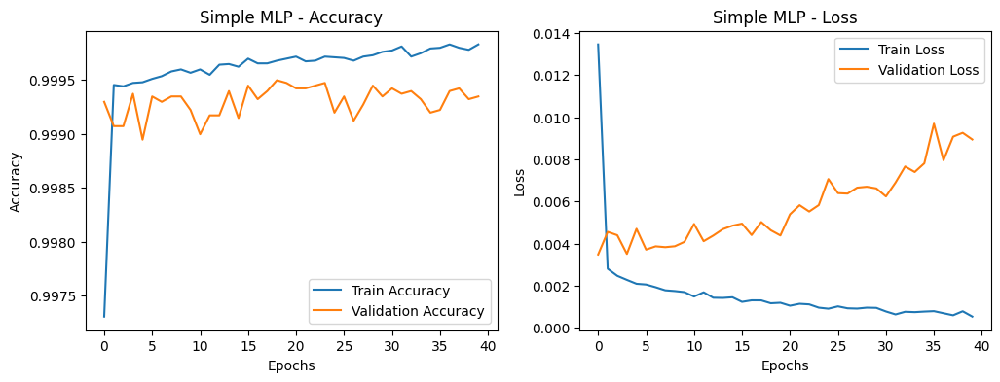
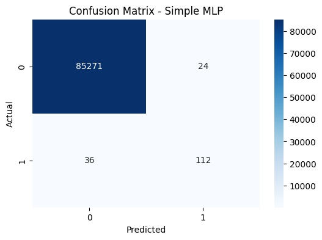

# CA1: Neural Networks Basics

This assignment covers fundamental concepts in neural networks and deep learning, providing a solid foundation for understanding the core principles of neural computation.

## Overview

The first assignment introduces essential neural network concepts including:
- Basic neural network architecture
- Forward and backward propagation
- Activation functions
- Loss functions and optimization
- Gradient descent algorithms

### Assignment Snapshot
- **Primary Notebook:** `code/NNDL_CA1_Q1.ipynb`
- **Focus Areas:** manual MLP/backprop implementation, optimizer comparisons, Adaline recap, autoencoder feature learning, and regression for concrete strength.
- **Datasets:** Kaggle Credit Card Fraud, UCI Concrete Strength, toy binary sets, and MNIST.
- **Target Metrics:**
	- Fraud Detection MLP ≈ 99.9% accuracy / 0.90 F1 / 0.98 AUC
	- Concrete Regression ≈ 88.45 MSE
	- Adaline on separable data → 100% training accuracy
	- Autoencoder + classifier ≈ 80% MNIST accuracy

## Contents

- `code/`: Implementation of basic neural networks
- `description/`: Assignment requirements and specifications
- `papers/`: Relevant research papers and references
- `report/`: Detailed analysis and results

## Key Concepts

### Neural Network Fundamentals
- **Neurons and Layers**: Understanding the building blocks of neural networks
- **Activation Functions**: Sigmoid, ReLU, Tanh, and their properties
- **Loss Functions**: Mean Squared Error, Cross-Entropy
- **Optimization**: Gradient Descent, Stochastic Gradient Descent

### Implementation Details
- **Forward Propagation**: Computing network outputs
- **Backpropagation**: Computing gradients for parameter updates
- **Weight Initialization**: Proper initialization techniques
- **Learning Rate Scheduling**: Adaptive learning rate methods

### Highlights & Experiments
- **Custom Network From Scratch**: Backpropagation is derived and coded manually for transparency, then cross-checked with PyTorch equivalents.
- **Optimization Studies**: Learning-rate sweeps and optimizer swaps (SGD vs. Adam) show convergence/stability trade-offs.
- **Activation Ablations**: Sigmoid, Tanh, and ReLU runs plotted side-by-side to illustrate vanishing- vs. exploding-gradient behavior.
- **Hyperparameter Logging**: Every experiment logs seeds, batch sizes, and stopping criteria to keep future reruns reproducible.

## Technical Implementation

The implementation demonstrates:
- Custom neural network from scratch using NumPy
- Comparison with PyTorch/TensorFlow implementations
- Hyperparameter tuning and analysis
- Performance evaluation on benchmark datasets

## Results and Analysis

- **Convergence Analysis**: Learning curves and optimization behavior
- **Hyperparameter Impact**: Effect of learning rate, batch size, and network size
- **Generalization**: Training vs. validation performance
- **Computational Efficiency**: Time and memory complexity analysis

### Representative Visuals
- 
	_Training dynamics validating manual backprop implementation._
- 
	_Activation comparisons (ReLU vs. Sigmoid vs. Tanh) and their learning curves._

## Educational Value

This assignment provides hands-on experience with:
- Mathematical foundations of neural networks
- Implementation challenges and best practices
- Debugging and troubleshooting techniques
- Performance optimization strategies

## Dependencies

- Python 3.8+
- NumPy
- Matplotlib
- Jupyter Notebook

## Usage

1. Navigate to the `code/` directory
2. Open and run the Jupyter notebook
3. Follow the step-by-step implementation guide
4. Analyze the results in the `report/` folder

## References

- [Assignment Description](description/)
- [Implementation Report](report/)
- [Research Papers](papers/)

---

**Course**: Neural Networks and Deep Learning (CA1)
**Institution**: University of Tehran
**Date**: September 2025