# 🚗 دسته‌بندی خودرو با استفاده از یادگیری عمیق

## مطالعه تطبیقی Transfer Learning و معماری‌های CNN سفارشی

---

**اطلاعات پروژه:**
- **نویسنده:** طها مجلسی
- **شماره دانشجویی:** 810101504
- **موسسه:** دانشگاه تهران، دانشکده مهندسی برق و کامپیوتر
- **درس:** شبکه‌های عصبی و یادگیری عمیق (CA2 - سوال 2)
- **سال:** 2024

---

## 📋 خلاصه پروژه

این پروژه به مطالعه تطبیقی جامع روش‌های یادگیری عمیق برای دسته‌بندی خودرو با استفاده از مجموعه داده تصاویر Toyota می‌پردازد. در این مطالعه چهار روش متمایز ارزیابی شده است:

1. **Transfer Learning با VGG16**: Fine-tuning معماری پیش‌آموزش‌داده‌شده VGG16
2. **Transfer Learning با AlexNet**: Fine-tuning معماری پیش‌آموزش‌داده‌شده AlexNet
3. **معماری CNN سفارشی**: آموزش شبکه عصبی کانولوشنی از صفر
4. **روش ترکیبی**: استفاده از SVM با ویژگی‌های استخراج‌شده از CNN

**نتایج کلیدی:** بهترین عملکرد مربوط به VGG16 + SVM (RBF) با دقت **69.6%** است. به دنبال آن Fine-tuning VGG16 با **67.9%** و AlexNet Fine-tuning با **61.4%** قرار دارند. معماری CNN سفارشی دقت **58.2%** را نشان می‌دهد.

---

## 📑 فهرست مطالب

1. [مرور کلی](#مرور-کلی)
2. [اهداف پروژه](#اهداف-پروژه)
3. [مجموعه داده](#مجموعه-داده)
4. [معماری‌های مدل](#معماریهای-مدل)
5. [روش‌شناسی](#روششناسی)
6. [نتایج](#نتایج)
7. [تحلیل و بحث](#تحلیل-و-بحث)
8. [نصب و اجرا](#نصب-و-اجرا)
9. [ساختار فایل‌ها](#ساختار-فایلها)
10. [مراجع](#مراجع)

---

## 🎯 مرور کلی

### هدف اصلی

توسعه و مقایسه روش‌های مختلف یادگیری عمیق برای دسته‌بندی 10 مدل مختلف خودروی Toyota از تصاویر.

### سوالات تحقیقاتی

1. عملکرد Transfer Learning در مقایسه با معماری‌های CNN سفارشی چگونه است؟
2. استفاده از Data Augmentation چه تأثیری بر عملکرد مدل‌ها دارد؟
3. آیا روش‌های یادگیری ماشین سنتی (SVM) می‌توانند از ویژگی‌های استخراج‌شده CNN به‌طور مؤثر استفاده کنند؟
4. کدام روش بهترین تعادل بین دقت و کارایی محاسباتی را ارائه می‌دهد؟

### کاربردهای عملی

- ✅ کنترل کیفی خودکار در خط تولید
- ✅ سیستم‌های نظارت ترافیک هوشمند
- ✅ پردازش خودکار بیمه خودرو
- ✅ سیستم‌های پارکینگ هوشمند
- ✅ دستیار تشخیص خودرو در فروشگاه‌های خودرو

---

## 📊 مجموعه داده

### مشخصات مجموعه داده

- **منبع**: Toyota Image Dataset v2
- **کلاس‌ها**: 10 مدل خودروی Toyota
- **رزولوشن**: استاندارد شده به 224×224 پیکسل
- **تقسیم**: 80% آموزش / 20% تست

### مدل‌های خودرو

| مدل | دسته‌بندی | ویژگی‌ها |
|-----|----------|----------|
| Corolla | سدان | طراحی فشرده و اقتصادی |
| Camry | سدان | سایز متوسط، مناسب خانواده |
| RAV4 | SUV | کراس‌اوور فشرده |
| Tacoma | وانت | وانت سایز متوسط |
| Highlander | SUV | کراس‌اوور سایز متوسط |
| Prius | سدان هیبریدی | سازگار با محیط زیست |
| Tundra | وانت | وانت تمام‌اندازه |
| 4Runner | SUV | SUV با شاسی مجزا |
| Yaris | هاچ‌بک | خودرو فشرده شهری |
| Sienna | مینی‌ون | مناسب خانواده |

### نمونه تصاویر مجموعه داده

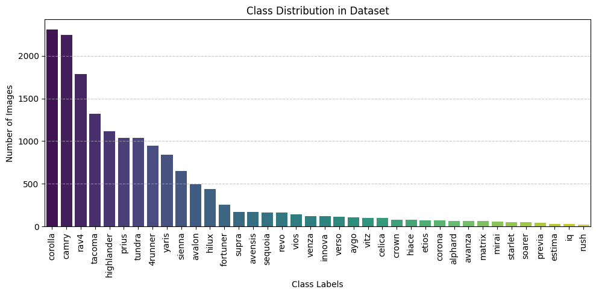

*نمونه‌هایی از تصاویر مجموعه داده*

### توزیع کلاس‌ها


*توزیع تعداد تصاویر در هر کلاس*

### توزیع کلاس‌ها بعد از متعادل‌سازی

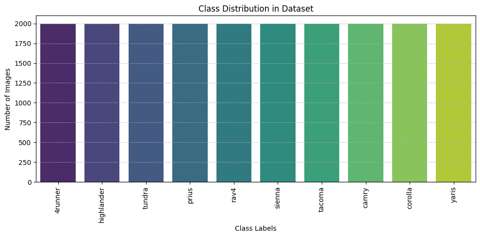

*توزیع کلاس‌ها بعد از Data Augmentation و متعادل‌سازی*

### نمونه تصاویر بعد از Augmentation

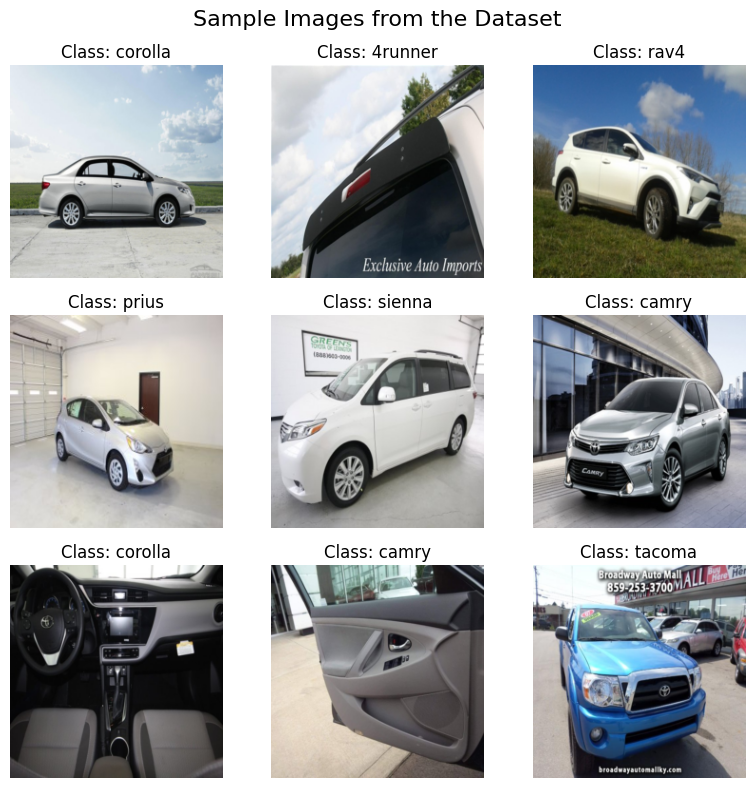

*نمونه‌هایی از تصاویر بعد از اعمال Data Augmentation*

---

## 🏗️ معماری‌های مدل

### 1. VGG16 Fine-tuning

**ویژگی‌ها:**
- معماری: 13 لایه کانولوشنی + 3 لایه Fully Connected
- بعد ویژگی: 25,088 (512×7×7)
- پارامترها: 119.5 میلیون
- استراتژی: Fine-tuning همه لایه‌ها

**نمودار معماری:**

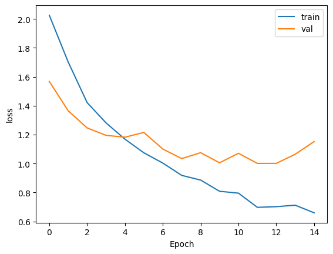

*خلاصه معماری VGG16 Classifier*

### 2. AlexNet Fine-tuning

**ویژگی‌ها:**
- معماری: 5 لایه کانولوشنی + 3 لایه Fully Connected
- بعد ویژگی: 9,216 (256×6×6)
- پارامترها: 54.6 میلیون
- استراتژی: Fine-tuning end-to-end

**نمودار معماری:**

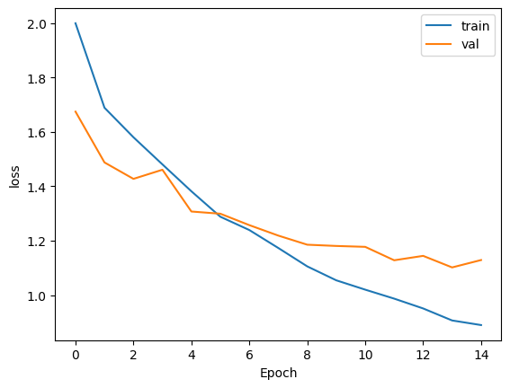

*خلاصه معماری AlexNet Classifier*

### 3. CNN سفارشی

**معماری:**
```python
class ToyotaModelCNN(nn.Module):
    def __init__(self):
        super().__init__()
        # Conv Blocks: [64, 64, 128, 128, 256, 256]
        # Fully Connected: 512 → 256 → 10
        # Dropout: 0.2
```

**ویژگی‌ها:**
- معماری از صفر طراحی شده
- فیلترهای کانولوشنی پیشرونده
- Batch Normalization برای پایداری
- Dropout برای جلوگیری از Overfitting

### 4. SVM با ویژگی‌های CNN

**روش:**
- استخراج ویژگی از VGG16 (ثابت)
- نرمال‌سازی StandardScaler
- SVM با کرنل‌های Linear و RBF

---

## 🔬 روش‌شناسی

### خط لوله پیش‌پردازش

1. **بارگذاری داده**: استفاده از PyTorch ImageFolder
2. **فیلتر کلاس**: انتخاب 10 مدل نماینده
3. **تشخیص فساد**: حذف تصاویر خراب
4. **تقسیم داده**: 80/20 stratified split
5. **Augmentation**: تبدیلات هندسی و رنگی

### تکنیک‌های Data Augmentation

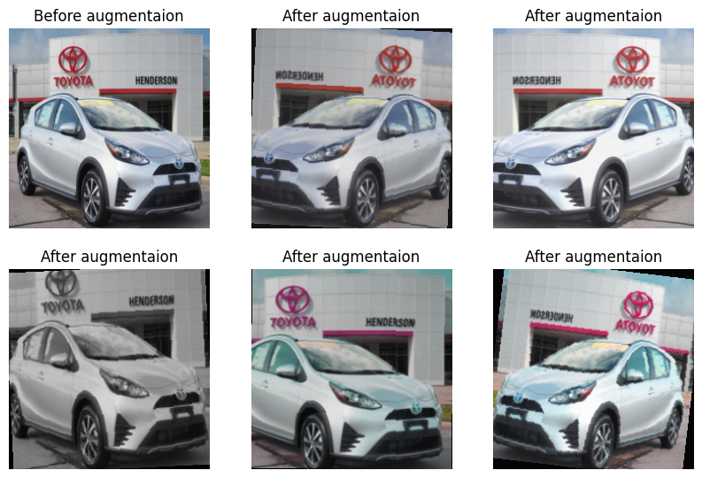

*نمونه‌هایی از داده‌های Augmented شده*

**تبدیلات اعمال شده:**
- 🔄 چرخش افقی تصادفی (50%)
- 🔄 چرخش تصادفی (±10 درجه)
- 🔄 برش تغییر اندازه شده (80-100%)
- 🎨 تنظیم روشنایی/کنتراست/اشباع (±20%)
- ⚫ تبدیل تصادفی به خاکستری (30%)

### استراتژی آموزش

**پارامترهای مشترک:**
- Optimizer: Adam (lr=0.001)
- Batch Size: 32
- Epochs: 15 (با early stopping)
- Loss: Cross-Entropy
- Weight Decay: 0.0001

---

## 📈 نتایج

### نتایج کلی

| مدل | دقت (Accuracy) | Precision | Recall | F1-Score | زمان آموزش |
|-----|----------------|-----------|--------|----------|-----------|
| **VGG16 + SVM (RBF)** | **🟢 69.6%** | 71.1% | 69.6% | 69.4% | ~12 دقیقه |
| **VGG16 Fine-tuning** | **🟡 67.9%** | 70.2% | 67.9% | 67.8% | ~15 دقیقه |
| **VGG16 + SVM (Linear)** | **🟡 67.0%** | 68.5% | 67.0% | 67.2% | ~12 دقیقه |
| **AlexNet Fine-tuning** | **🟠 61.4%** | 64.0% | 61.4% | 61.5% | ~10 دقیقه |
| **CNN سفارشی** | **🔴 58.2%** | 60.8% | 58.2% | 58.1% | ~25 دقیقه |

### نمودارهای مقایسه عملکرد

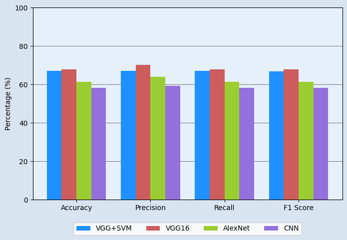

*مقایسه عملکرد تمام مدل‌ها*

### منحنی‌های آموزش

#### VGG16 Fine-tuning

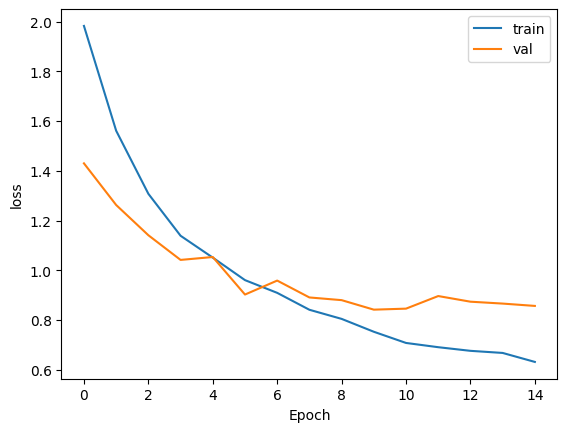

*منحنی‌های Loss و Accuracy برای VGG16*

#### AlexNet Fine-tuning

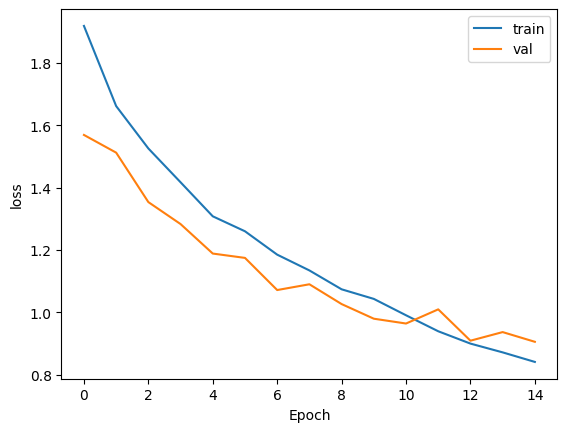

*منحنی‌های Loss و Accuracy برای AlexNet*

#### CNN سفارشی

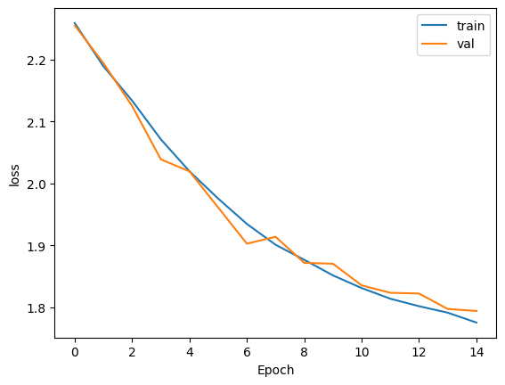

*منحنی‌های Loss و Accuracy برای CNN سفارشی*

### Confusion Matrix ها

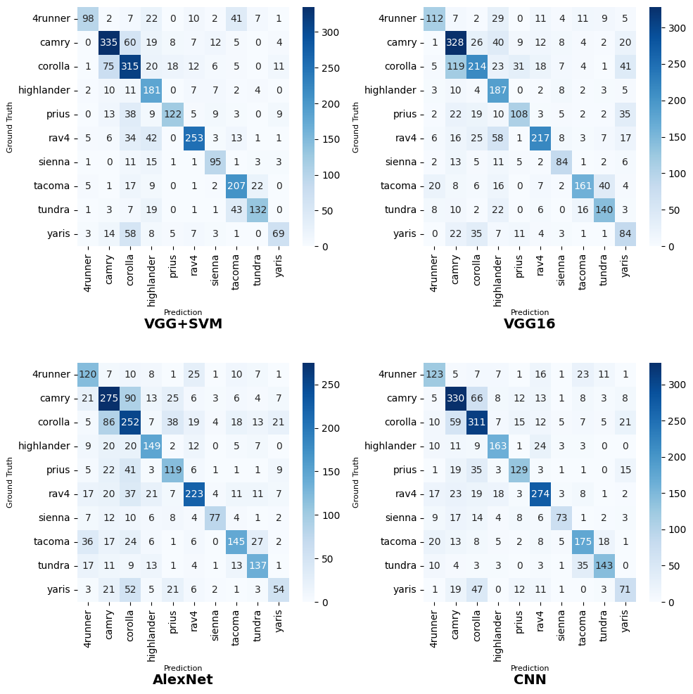

*Confusion Matrix های تمام مدل‌ها*

**تحلیل Confusion Matrix:**
- 🏆 **وانت‌ها (Tacoma, Tundra)**: بهترین عملکرد به دلیل تفاوت واضح در اندازه
- 🏆 **Prius**: دقت بالا به دلیل طراحی منحصر به فرد
- ⚠️ **سدان‌ها (Corolla ↔ Camry)**: بیشترین خطا به دلیل شباهت زیاد

### تأثیر Data Augmentation

| مدل | بدون Augmentation | با Augmentation | بهبود |
|-----|------------------|----------------|-------|
| VGG16 Fine-tuning | ~63% | **67.9%** | **+4.9%** |
| AlexNet Fine-tuning | ~56% | **61.4%** | **+5.4%** |
| CNN سفارشی | ~52% | **58.2%** | **+6.2%** |

---

## 🔍 تحلیل و بحث

### بینش‌های کلیدی

#### 1. برتری Transfer Learning

✅ **نتایج نشان می‌دهد:**
- Transfer Learning به طور قابل توجهی بهتر از آموزش از صفر عمل می‌کند
- VGG16 (67.9%) نسبت به CNN سفارشی (58.2%) **+9.7%** بهتر است
- معماری عمیق‌تر (VGG16) بهتر از معماری سبک‌تر (AlexNet) عمل می‌کند

#### 2. کارایی رویکردهای ترکیبی

✅ **VGG16 + SVM (RBF) بهترین عملکرد را دارد:**
- دقت 69.6% (بهترین)
- زمان آموزش کمتر (بدون backpropagation در CNN)
- نشان می‌دهد که ویژگی‌های CNN برای ML سنتی نیز عالی هستند

#### 3. اهمیت Data Augmentation

✅ **بهبود قابل توجه در همه مدل‌ها:**
- کاهش Overfitting
- بهبود تعمیم
- افزایش مقاومت در برابر تغییرات نور و زاویه

### چالش‌های Fine-Grained Classification

⚠️ **کلاس‌های مشکل‌دار:**
- سدان‌های مشابه (Corolla ↔ Camry)
- SUV های مشابه (RAV4 ↔ Highlander)

💡 **راه‌حل‌های پیشنهادی:**
- استفاده از Attention Mechanisms
- Multi-scale Feature Learning
- Ensemble Methods

### کارایی محاسباتی

| مدل | زمان آموزش | زمان استنتاج | حافظه GPU |
|-----|-----------|-------------|-----------|
| VGG16 Fine-tuning | ~15 دقیقه | ~0.05s/batch | ~8GB |
| VGG16 + SVM | ~12 دقیقه | ~0.08s/batch | ~6GB |
| AlexNet Fine-tuning | ~10 دقیقه | ~0.04s/batch | ~5GB |
| CNN سفارشی | ~25 دقیقه | ~0.03s/batch | ~4GB |

---

## 💻 نصب و اجرا

### پیش‌نیازها

```bash
# Python 3.8+
# CUDA 11.8+ (برای GPU)
```

### نصب کتابخانه‌ها

```bash
pip install torch torchvision torchaudio
pip install numpy pandas matplotlib seaborn
pip install scikit-learn tqdm pillow
```

### اجرای نوت‌بوک

1. بارگذاری نوت‌بوک در Jupyter/Colab
2. تنظیم مسیر داده در CONFIG
3. اجرای سلول‌ها به ترتیب

### پیکربندی

```python
class CONFIG:
    seed = 42
    width, height = 224, 224
    path = "/path/to/toyota_cars/"
    batch_size = 32
    epochs = 15
    learning_rate = 0.001
```

---

## 📁 ساختار فایل‌ها

```
Vehicle_Classification/
├── code/
│   └── NNDL_CA2_2.ipynb          # نوت‌بوک اصلی
├── images/
│   ├── notebook_output_*.png     # تصاویر استخراج شده
│   └── notebook_image_*.png      # تصاویر اضافی
├── description/
│   ├── NNDL_HW2.pdf              # دستور کار
│   └── NNDL_UT_CA2_D.pdf         # توضیحات
├── paper/
│   └── A Hybrid Deep Learning...pdf  # مقاله مرجع
├── report/
│   └── NNDL_UT_CA2_Q2.pdf        # گزارش کامل
└── README.md                     # این فایل
```

---

## 🎓 مفاهیم پوشش داده شده

### Convolutional Neural Networks (CNNs)
- لایه‌های کانولوشنی و Pooling
- Batch Normalization
- Dropout و Regularization

### Transfer Learning
- Fine-tuning مدل‌های پیش‌آموزش‌داده‌شده
- استخراج ویژگی
- جایگزینی Classifier

### Data Augmentation
- تبدیلات هندسی
- تبدیلات رنگی
- استراتژی‌های پیشرفته

### ارزیابی مدل
- معیارهای Classification (Accuracy, Precision, Recall, F1)
- Confusion Matrix
- تحلیل عملکرد

---

## 🔮 کارهای آینده

### بهبودهای فنی پیشنهادی

1. **معماری‌های پیشرفته**:
   - Vision Transformers (ViT)
   - Attention Mechanisms
   - Multi-scale Feature Learning

2. **بهبود مجموعه داده**:
   - جمع‌آوری داده بیشتر
   - Annotation بهتر
   - Domain Adaptation

3. **بهینه‌سازی Real-Time**:
   - Quantization و Pruning
   - مدل‌های سبک‌وزن (MobileNet, EfficientNet)
   - Knowledge Distillation

4. **بهبود Fine-Grained Classification**:
   - Hard Negative Mining
   - Ensemble Methods
   - Self-Supervised Learning

---

## 📚 مراجع

### مقالات کلیدی

1. **VGG16**: Simonyan, K., & Zisserman, A. (2014). Very deep convolutional networks for large-scale image recognition. arXiv preprint arXiv:1409.1556.

2. **AlexNet**: Krizhevsky, A., Sutskever, I., & Hinton, G. E. (2012). ImageNet classification with deep convolutional neural networks. Advances in Neural Information Processing Systems.

3. **Transfer Learning**: Yosinski, J., Clune, J., Bengio, Y., & Lipson, H. (2014). How transferable are features in deep neural networks? Advances in Neural Information Processing Systems.

4. **Vehicle Classification**: A Hybrid Deep Learning VGG-16 Based SVM Model for Vehicle Type Classification. (مقاله در پوشه paper/)

### منابع داده

- **Toyota Image Dataset v2**: Kaggle Dataset

---

## 👤 اطلاعات نویسنده

**طها مجلسی**  
دانشجوی کارشناسی ارشد  
دانشگاه تهران، دانشکده مهندسی برق و کامپیوتر  
شماره دانشجویی: 810101504

---

## 📝 لایسنس

این پروژه بخشی از پروژه‌های درسی دوره Neural Networks and Deep Learning است.

---

## 🙏 قدردانی

از دانشگاه تهران و استادان محترم برای ارائه این فرصت یادگیری و تحقیق سپاسگزاریم.

---

**آخرین به‌روزرسانی:** 2024
