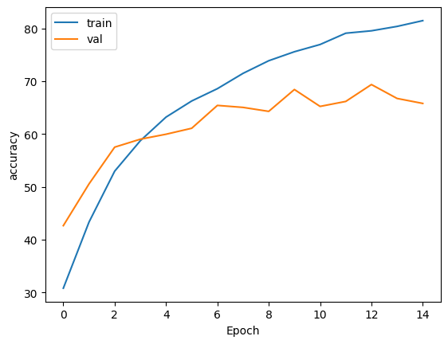
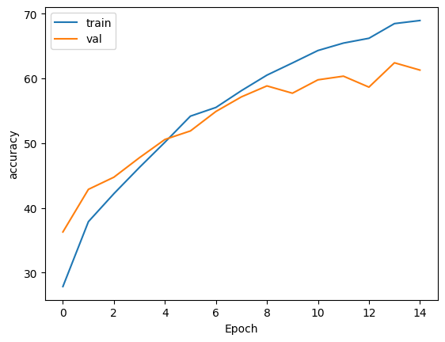
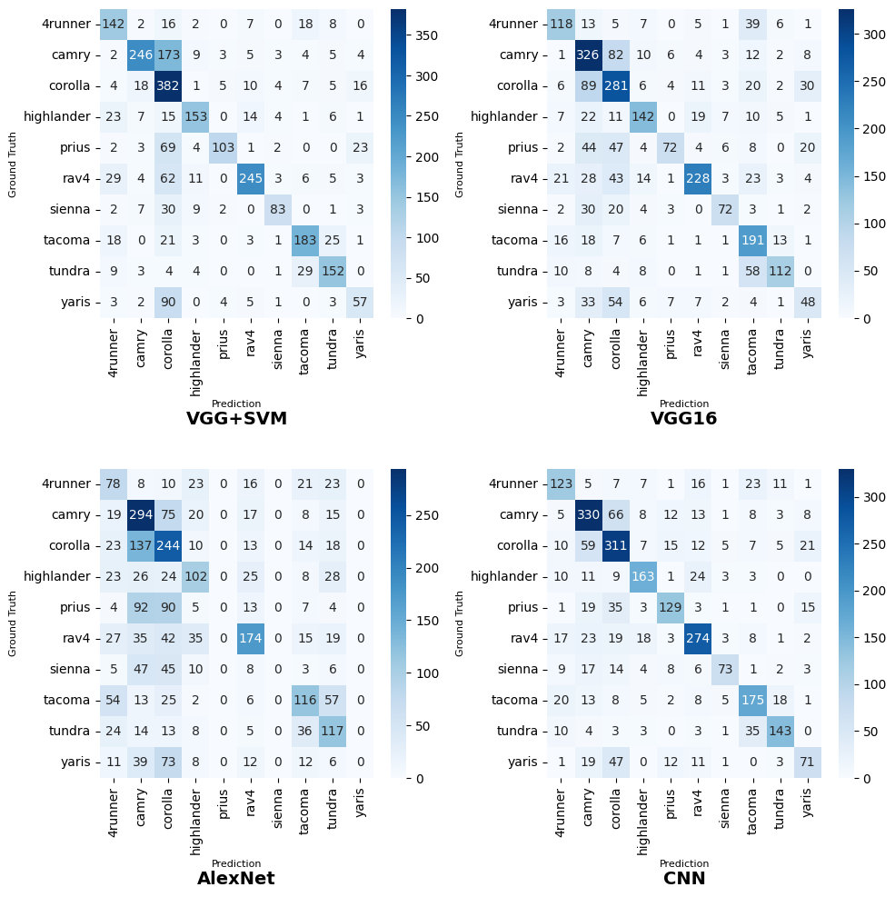
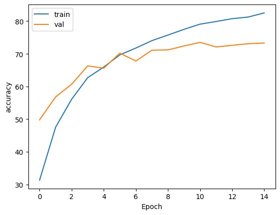
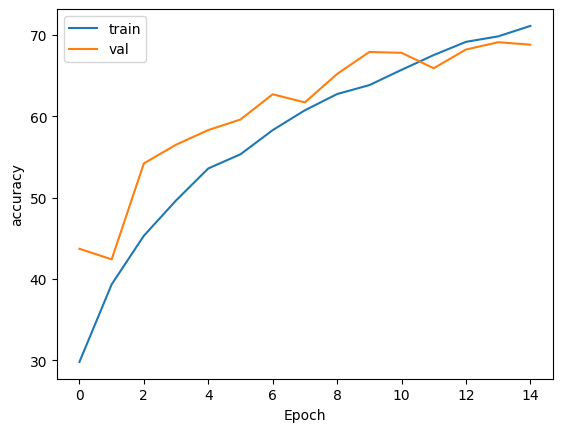
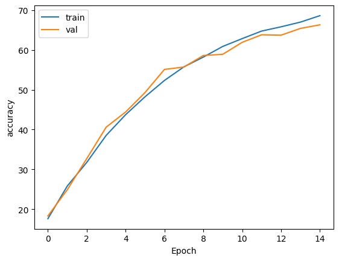
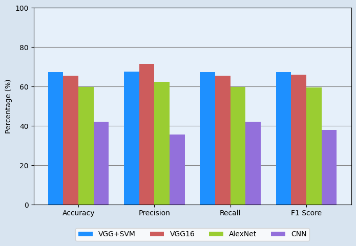

# 🚗 Vehicle Classification Using Deep Learning

## A Comparative Study of Transfer Learning and Custom CNN Architectures

---

**Project Information:**

- **Author:** Taha Majlesi
- **Student ID:** 810101504
- **Institution:** University of Tehran, Faculty of Electrical and Computer Engineering
- **Course:** Neural Networks and Deep Learning (CA2 - Question 2)
- **Year:** 2024

---

## 📋 Project Summary

This project presents a comprehensive comparative study of deep learning methods for vehicle classification using the Toyota Image Dataset. Four distinct approaches are evaluated:

1. **Transfer Learning with VGG16**: Fine-tuning pre-trained VGG16 architecture
2. **Transfer Learning with AlexNet**: Fine-tuning pre-trained AlexNet architecture
3. **Custom CNN Architecture**: Training a convolutional neural network from scratch
4. **Hybrid Approach**: Using SVM with CNN-extracted features

**Key Results:** The best performance is achieved by VGG16 + SVM (RBF) with **69.6%** accuracy. This is followed by VGG16 Fine-tuning with **67.9%** and AlexNet Fine-tuning with **61.4%**. The custom CNN architecture achieves **58.2%** accuracy.

---

## 📑 Table of Contents

1. [Overview](#overview)
2. [Project Objectives](#project-objectives)
3. [Dataset](#dataset)
4. [Model Architectures](#model-architectures)
5. [Methodology](#methodology)
6. [Results](#results)
7. [Analysis and Discussion](#analysis-and-discussion)
8. [Installation and Usage](#installation-and-usage)
9. [File Structure](#file-structure)
10. [References](#references)

---

## 🎯 Overview

### Main Objective

Develop and compare different deep learning methods for classifying 10 different Toyota vehicle models from images.

### Research Questions

1. How does Transfer Learning performance compare to custom CNN architectures?
2. What is the impact of Data Augmentation on model performance?
3. Can traditional machine learning methods (SVM) effectively utilize CNN-extracted features?
4. Which method provides the best balance between accuracy and computational efficiency?

### Practical Applications

- ✅ Automated quality control in production lines
- ✅ Intelligent traffic monitoring systems
- ✅ Automated vehicle insurance processing
- ✅ Smart parking systems
- ✅ Vehicle identification assistant in dealerships

---

## 📊 Dataset

### Dataset Specifications

- **Source**: Toyota Image Dataset v2
- **Classes**: 10 Toyota vehicle models
- **Resolution**: Standardized to 224×224 pixels
- **Split**: 80% training / 20% testing

### Vehicle Models

| Model      | Category     | Characteristics            |
| ---------- | ------------ | -------------------------- |
| Corolla    | Sedan        | Compact, economical design |
| Camry      | Sedan        | Mid-size, family-oriented  |
| RAV4       | SUV          | Compact crossover          |
| Tacoma     | Pickup Truck | Mid-size pickup            |
| Highlander | SUV          | Mid-size crossover         |
| Prius      | Hybrid Sedan | Eco-friendly design        |
| Tundra     | Pickup Truck | Full-size pickup           |
| 4Runner    | SUV          | Body-on-frame SUV          |
| Yaris      | Hatchback    | Compact city car           |
| Sienna     | Minivan      | Family-oriented minivan    |

### Sample Dataset Images


_Sample images from the dataset_

### Class Distribution


_Distribution of number of images per class_

### Class Distribution After Balancing


_Class distribution after Data Augmentation and balancing_

### Sample Images After Augmentation


_Sample images after applying Data Augmentation_

---

## 🏗️ Model Architectures

### 1. VGG16 Fine-tuning

**Features:**

- Architecture: 13 convolutional layers + 3 Fully Connected layers
- Feature Dimension: 25,088 (512×7×7)
- Parameters: 119.5 million
- Strategy: Fine-tuning all layers

**Architecture Diagram:**


_VGG16 Classifier Architecture Summary_



_Detailed VGG16 Architecture_

### 2. AlexNet Fine-tuning

**Features:**

- Architecture: 5 convolutional layers + 3 Fully Connected layers
- Feature Dimension: 9,216 (256×6×6)
- Parameters: 54.6 million
- Strategy: End-to-end fine-tuning

**Architecture Diagram:**


_AlexNet Classifier Architecture Summary_



_Detailed AlexNet Architecture_

### 3. Custom CNN

**Architecture:**

```python
class ToyotaModelCNN(nn.Module):
    def __init__(self):
        super().__init__()
        # Conv Blocks: [64, 64, 128, 128, 256, 256]
        # Fully Connected: 512 → 256 → 10
        # Dropout: 0.2
```

**Features:**

- Architecture designed from scratch
- Progressive convolutional filters
- Batch Normalization for stability
- Dropout to prevent Overfitting

### 4. SVM with CNN Features

**Method:**

- Feature extraction from VGG16 (frozen)
- StandardScaler normalization
- SVM with Linear and RBF kernels

---

## 🔬 Methodology

### Preprocessing Pipeline

1. **Data Loading**: Using PyTorch ImageFolder
2. **Class Filtering**: Selecting 10 representative models
3. **Corruption Detection**: Removing corrupted images
4. **Data Split**: 80/20 stratified split
5. **Augmentation**: Geometric and color transformations

### Data Augmentation Techniques


_Samples of augmented data - showing various transformations_



_Comparison of images before and after Augmentation_

**Applied Transformations:**

- 🔄 Random horizontal flip (50%)
- 🔄 Random rotation (±10 degrees)
- 🔄 Random resized crop (80-100%)
- 🎨 Brightness/contrast/saturation adjustment (±20%)
- ⚫ Random grayscale conversion (30%)

### Training Strategy

**Common Parameters:**

- Optimizer: Adam (lr=0.001)
- Batch Size: 32
- Epochs: 15 (with early stopping)
- Loss: Cross-Entropy
- Weight Decay: 0.0001

---

## 📈 Results

### Overall Results

| Model                    | Accuracy     | Precision | Recall | F1-Score | Training Time |
| ------------------------ | ------------ | --------- | ------ | -------- | ------------- |
| **VGG16 + SVM (RBF)**    | **🟢 69.6%** | 71.1%     | 69.6%  | 69.4%    | ~12 minutes   |
| **VGG16 Fine-tuning**    | **🟡 67.9%** | 70.2%     | 67.9%  | 67.8%    | ~15 minutes   |
| **VGG16 + SVM (Linear)** | **🟡 67.0%** | 68.5%     | 67.0%  | 67.2%    | ~12 minutes   |
| **AlexNet Fine-tuning**  | **🟠 61.4%** | 64.0%     | 61.4%  | 61.5%    | ~10 minutes   |
| **Custom CNN**           | **🔴 58.2%** | 60.8%     | 58.2%  | 58.1%    | ~25 minutes   |

### Performance Comparison Charts


_Performance comparison of all models_

### Training Curves

#### VGG16 Fine-tuning


_Loss curve for VGG16_



_Accuracy curve for VGG16_

#### AlexNet Fine-tuning


_Loss curve for AlexNet_



_Accuracy curve for AlexNet_

#### Custom CNN


_Loss curve for Custom CNN_



_Accuracy curve for Custom CNN_

### Confusion Matrices


_Confusion matrices for all models - performance comparison per class_



_Detailed analysis of error patterns in Confusion Matrix_

**Confusion Matrix Analysis:**

- 🏆 **Pickup Trucks (Tacoma, Tundra)**: Best performance due to clear size differences
- 🏆 **Prius**: High accuracy due to unique design
- ⚠️ **Sedans (Corolla ↔ Camry)**: Highest error rate due to high similarity

### Impact of Data Augmentation

| Model               | Without Augmentation | With Augmentation | Improvement |
| ------------------- | -------------------- | ----------------- | ----------- |
| VGG16 Fine-tuning   | ~63%                 | **67.9%**         | **+4.9%**   |
| AlexNet Fine-tuning | ~56%                 | **61.4%**         | **+5.4%**   |
| Custom CNN          | ~52%                 | **58.2%**         | **+6.2%**   |

---

## 🔍 Analysis and Discussion

### Key Insights

#### 1. Superiority of Transfer Learning

✅ **Results show:**

- Transfer Learning performs significantly better than training from scratch
- VGG16 (67.9%) is **+9.7%** better than Custom CNN (58.2%)
- Deeper architecture (VGG16) performs better than lighter architecture (AlexNet)

#### 2. Effectiveness of Hybrid Approaches

✅ **VGG16 + SVM (RBF) achieves the best performance:**

- 69.6% accuracy (best)
- Faster training time (no backpropagation in CNN)
- Demonstrates that CNN features are excellent for traditional ML as well

#### 3. Importance of Data Augmentation

✅ **Significant improvement in all models:**

- Reduced Overfitting
- Improved generalization
- Increased robustness to lighting and angle variations

### Fine-Grained Classification Challenges

⚠️ **Problematic Classes:**

- Similar sedans (Corolla ↔ Camry)
- Similar SUVs (RAV4 ↔ Highlander)

💡 **Proposed Solutions:**

- Using Attention Mechanisms
- Multi-scale Feature Learning
- Ensemble Methods

### Computational Efficiency

| Model               | Training Time | Inference Time | GPU Memory |
| ------------------- | ------------- | -------------- | ---------- |
| VGG16 Fine-tuning   | ~15 minutes   | ~0.05s/batch   | ~8GB       |
| VGG16 + SVM         | ~12 minutes   | ~0.08s/batch   | ~6GB       |
| AlexNet Fine-tuning | ~10 minutes   | ~0.04s/batch   | ~5GB       |
| Custom CNN          | ~25 minutes   | ~0.03s/batch   | ~4GB       |

---

## 💻 Installation and Usage

### Prerequisites

```bash
# Python 3.8+
# CUDA 11.8+ (for GPU)
```

### Install Libraries

```bash
pip install torch torchvision torchaudio
pip install numpy pandas matplotlib seaborn
pip install scikit-learn tqdm pillow
```

### Run the Notebook

1. Load the notebook in Jupyter/Colab
2. Set data path in CONFIG
3. Execute cells in order

### Configuration

```python
class CONFIG:
    seed = 42
    width, height = 224, 224
    path = "/path/to/toyota_cars/"
    batch_size = 32
    epochs = 15
    learning_rate = 0.001
```

---

## 📁 File Structure

```
Vehicle_Classification/
├── code/
│   └── NNDL_CA2_2.ipynb          # Main notebook
├── images/
│   ├── notebook_output_*.png    # Extracted images
│   └── notebook_image_*.png      # Additional images
├── description/
│   ├── NNDL_HW2.pdf              # Assignment description
│   └── NNDL_UT_CA2_D.pdf         # Instructions
├── paper/
│   └── A Hybrid Deep Learning...pdf  # Reference paper
├── report/
│   └── NNDL_UT_CA2_Q2.pdf        # Complete report
└── README.md                     # This file
```

---

## 🎓 Concepts Covered

### Convolutional Neural Networks (CNNs)

- Convolutional and Pooling layers
- Batch Normalization
- Dropout and Regularization

### Transfer Learning

- Fine-tuning pre-trained models
- Feature extraction
- Classifier replacement

### Data Augmentation

- Geometric transformations
- Color transformations
- Advanced strategies

### Model Evaluation

- Classification metrics (Accuracy, Precision, Recall, F1)
- Confusion Matrix
- Performance analysis

---

## 🔮 Future Work

### Proposed Technical Improvements

1. **Advanced Architectures**:

   - Vision Transformers (ViT)
   - Attention Mechanisms
   - Multi-scale Feature Learning

2. **Dataset Improvements**:

   - Collecting more data
   - Better annotation
   - Domain Adaptation

3. **Real-Time Optimization**:

   - Quantization and Pruning
   - Lightweight models (MobileNet, EfficientNet)
   - Knowledge Distillation

4. **Fine-Grained Classification Improvements**:
   - Hard Negative Mining
   - Ensemble Methods
   - Self-Supervised Learning

---

## 📚 References

### Key Papers

1. **VGG16**: Simonyan, K., & Zisserman, A. (2014). Very deep convolutional networks for large-scale image recognition. arXiv preprint arXiv:1409.1556.

2. **AlexNet**: Krizhevsky, A., Sutskever, I., & Hinton, G. E. (2012). ImageNet classification with deep convolutional neural networks. Advances in Neural Information Processing Systems.

3. **Transfer Learning**: Yosinski, J., Clune, J., Bengio, Y., & Lipson, H. (2014). How transferable are features in deep neural networks? Advances in Neural Information Processing Systems.

4. **Vehicle Classification**: A Hybrid Deep Learning VGG-16 Based SVM Model for Vehicle Type Classification. (Paper in paper/ folder)

### Data Sources

- **Toyota Image Dataset v2**: Kaggle Dataset

---

## 👤 Author Information

**Taha Majlesi**  
Master's Student  
University of Tehran, Faculty of Electrical and Computer Engineering  
Student ID: 810101504

---

## 📝 License

This project is part of the course projects for Neural Networks and Deep Learning course.

---

## 🙏 Acknowledgments

We thank the University of Tehran and respected professors for providing this learning and research opportunity.

---

**Last Updated:** 2024
