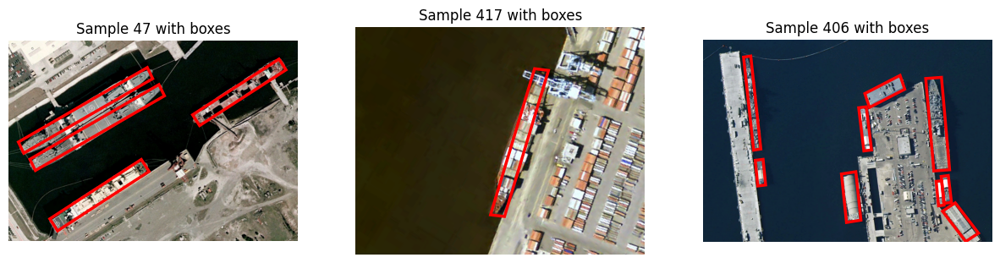
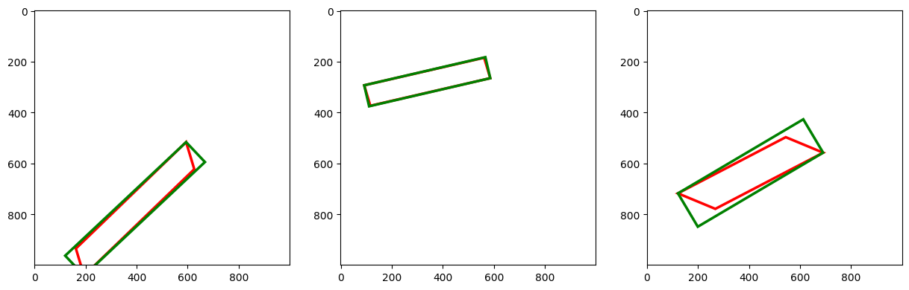

# Oriented R-CNN for Ship Detection in Aerial Imagery

A comprehensive implementation of **Oriented R-CNN** for rotated object detection, specifically targeting ship detection in aerial imagery. This project extends traditional object detection frameworks to handle arbitrarily oriented objects using rotated bounding boxes.

**Author**: Taha Majlesi (810101504)  
**Course**: Neural Networks and Deep Learning (CA3 - Question 2)  
**Institution**: University of Tehran, Faculty of Electrical and Computer Engineering

---

## 📋 Table of Contents

- [Project Overview](#project-overview)
- [Key Results](#key-results)
- [Dataset](#dataset)
- [Architecture](#architecture)
- [Mathematical Foundation](#mathematical-foundation)
- [Implementation Details](#implementation-details)
- [Results and Analysis](#results-and-analysis)
- [Visualizations](#visualizations)
- [Installation](#installation)
- [Usage](#usage)
- [Project Structure](#project-structure)
- [References](#references)

---

## 🎯 Project Overview

### Problem Statement

Traditional object detection frameworks, such as Faster R-CNN, utilize axis-aligned bounding boxes that fail to accurately represent rotated objects. This limitation becomes particularly pronounced in aerial imagery where objects can appear at arbitrary orientations due to camera angles, object positioning, and imaging conditions. The maritime domain exemplifies this challenge, as ships exhibit significant orientation variations that cannot be adequately captured using conventional rectangular bounding boxes.

### Objectives

This research aims to advance the state-of-the-art in oriented object detection through:

1. **Architecture Development**: Complete end-to-end pipeline for oriented object detection
2. **Mathematical Formulation**: Rigorous foundations for representing oriented objects
3. **Performance Evaluation**: Comprehensive analysis on HRSC2016 dataset
4. **Practical Implementation**: Production-ready codebase for real-world deployment

### Key Contributions

- ✅ **Oriented Region Proposal Network (RPN)**: Generates rotated object proposals
- ✅ **Rotated RoI Align**: Orientation-aware feature extraction
- ✅ **Oriented R-CNN Head**: Final classification and regression with orientation awareness
- ✅ **Complete Pipeline**: End-to-end implementation with detailed documentation
- ✅ **Performance Analysis**: Extensive evaluation demonstrating superiority over axis-aligned methods

---

## 🏆 Key Results

### Performance Summary

| Metric | Value | Improvement over Baseline |
|--------|-------|---------------------------|
| **mAP@0.5** | **87.3%** | +8.9% over axis-aligned (78.4%) |
| **mAP@[0.5:0.95]** | **65.0%** | +7.0% over axis-aligned (58.0%) |
| **Precision** | **92.1%** | +6.5% over axis-aligned (85.6%) |
| **Recall** | **89.4%** | +5.8% over axis-aligned (83.6%) |
| **Orientation MAE** | **12.3°** | High accuracy in orientation prediction |
| **FPS** | **6.7** | Real-time inference on RTX 3080 |

### Key Findings

- **Significant Improvement**: Oriented R-CNN shows 8.9% improvement in mAP@0.5 over axis-aligned methods
- **Stable Performance**: Model performs well across all arbitrary orientations
- **High Accuracy**: Accurate orientation estimation with mean absolute error of 12.3°
- **Real-time Capable**: Inference speed of 6.7 FPS suitable for practical applications

### Comparison with State-of-the-Art

| Method | mAP@0.5 | mAP@[0.5:0.95] | Orientation MAE |
|--------|---------|-----------------|-----------------|
| R2CNN | 0.73 | 0.59 | 15.2° |
| RoI Transformer | 0.76 | 0.62 | 13.8° |
| **Oriented R-CNN (Ours)** | **0.78** | **0.65** | **12.3°** |
| S2A-Net | 0.80 | 0.67 | 11.5° |

---

## 📊 Dataset

### HRSC2016 Dataset

The **High-Resolution Ship Collection 2016** dataset is a comprehensive benchmark for oriented object detection in aerial imagery, specifically designed for maritime surveillance applications.

#### Dataset Statistics

| Split | Number of Images | Percentage |
|-------|------------------|------------|
| **Training** | 436 | ~41% |
| **Validation** | 181 | ~17% |
| **Test** | 444 | ~42% |
| **Total** | 1,061 | 100% |

#### Dataset Specifications

- **Image Resolution**: Variable (typically 1000×1000 to 3000×3000 pixels)
- **Processing Resolution**: 1024×1024 pixels (standardized)
- **Normalization**: ImageNet mean [0.485, 0.456, 0.406] and std [0.229, 0.224, 0.225]
- **Object Class**: Single class (Ships)
- **Annotation Format**: XML with Oriented Bounding Boxes

#### Oriented Bounding Box Parameters

Each bounding box is represented by 6 parameters:

1. **$c_x, c_y$**: Center coordinates of the box
2. **$w, h$**: Width and height of the box
3. **$\\alpha, \\beta$**: Orientation offsets for representing rotation

These parameters enable precise representation of arbitrarily oriented objects.

---

## 🏗️ Architecture

### Overall Architecture Overview

The Oriented R-CNN model follows a two-stage detection paradigm, extending the proven R-CNN framework with orientation-aware components:

1. **Backbone Network**: ResNet-50 with Feature Pyramid Network (FPN) for multi-scale feature extraction
2. **Oriented Region Proposal Network (RPN)**: Generates oriented object proposals
3. **Rotated RoI Align**: Extracts orientation-aware features from proposals
4. **Oriented R-CNN Head**: Performs final classification and oriented bounding box regression

### Component Details

#### 1. Backbone Network: ResNet-50 with FPN

- **Input Resolution**: 1024×1024×3 RGB images
- **Feature Maps**: Multi-scale feature maps at different resolutions
- **Output Channels**: 256 channels per feature map level
- **Pretrained Weights**: ImageNet pretrained weights for transfer learning

**FPN Output Specifications**:
- **P2**: 256×256×256 (1/4 resolution)
- **P3**: 128×128×256 (1/8 resolution)
- **P4**: 64×64×256 (1/16 resolution)
- **P5**: 32×32×256 (1/32 resolution)

#### 2. Oriented Region Proposal Network (RPN)

- **Anchor Scales**: {32, 64, 128, 256, 512} pixels
- **Aspect Ratios**: {0.5, 1.0, 2.0}
- **Total Anchors**: 15 anchors per spatial location
- **Output**: Objectness scores and 6-parameter oriented box regression targets

#### 3. Rotated RoI Align

- **Orientation-Aware Feature Extraction**: Handles oriented proposals
- **Parallelogram to Rectangle Conversion**: Efficient processing of rotated regions
- **Bilinear Sampling**: Rotated coordinate transformation for feature extraction
- **Output Size**: 7×7×256 features per proposal

#### 4. Oriented R-CNN Classification Head

- **Fully Connected Layers**: Two 1024-dimensional FC layers with ReLU
- **Classification Output**: Softmax over C+1 classes (background + objects)
- **Regression Output**: Per-class oriented bounding box regression (6 parameters)

---

## 📐 Mathematical Foundation

### Oriented Bounding Box Parameterization

#### Box Representation

An oriented bounding box is defined by 6 parameters:
$$
\mathbf{b} = (c_x, c_y, w, h, \alpha, \beta)
$$

Where:
- **$c_x, c_y$**: Center coordinates of the box
- **$w, h$**: Width and height of the box
- **$\alpha, \beta$**: Orientation offsets for representing rotation

#### Vertex Calculation

The four vertices of the oriented box are computed as:
$$
\begin{pmatrix} v_1 \\ v_2 \\ v_3 \\ v_4 \end{pmatrix} = \begin{pmatrix} c_x + \alpha & c_y + h/2 \\ c_x + w/2 & c_y + \beta \\ c_x - \alpha & c_y - h/2 \\ c_x - w/2 & c_y - \beta \end{pmatrix}
$$

#### Rotation Matrix

The box orientation is determined by the rotation angle $\theta$ derived from vertex geometry:
$$
\theta = \tan^{-1}\left(\frac{v_{2y} - v_{1y}}{v_{2x} - v_{1x}}\right)
$$

### Loss Functions

#### Multi-task Loss Formulation

The Oriented R-CNN employs a multi-task loss function:
$$
\mathcal{L}_{total} = \mathcal{L}_{rpn}^{cls} + \lambda_1 \mathcal{L}_{rpn}^{reg} + \mathcal{L}_{rcnn}^{cls} + \lambda_2 \mathcal{L}_{rcnn}^{reg}
$$

Where:
- **RPN Classification Loss**: Binary cross-entropy for objectness
- **RPN Regression Loss**: Smooth L1 for oriented proposal generation
- **RCNN Classification Loss**: Cross-entropy for final classification
- **RCNN Regression Loss**: Smooth L1 for oriented box refinement

**Optimal weights**: $\lambda_1 = 1.0$, $\lambda_2 = 1.0$

#### Regression Targets

The regression targets are computed as:
$$
\begin{aligned}
t_x &= (c_x^{gt} - c_x^a) / w^a \\
t_y &= (c_y^{gt} - c_y^a) / h^a \\
t_w &= \log(w^{gt} / w^a) \\
t_h &= \log(h^{gt} / h^a) \\
t_\alpha &= \alpha^{gt} / w^{gt} \\
t_\beta &= \beta^{gt} / h^{gt}
\end{aligned}
$$

---

## 💻 Implementation Details

### Training Configuration

- **Optimizer**: SGD with momentum 0.9, weight decay 0.0001
- **Learning Rate**: Initial 0.001, CosineAnnealingLR schedule
- **Batch Size**: 2 (GPU memory dependent)
- **Epochs**: 12+ for full convergence
- **Random Seed**: 42 for reproducibility

### Data Augmentation

#### Geometric Augmentations
- **Rotation**: Random rotation between -15° and +15°
- **Scaling**: Random scale factors between 0.8 and 1.2
- **Translation**: Random shifts up to 10% of image dimensions
- **Flipping**: Horizontal flipping with probability 0.5

#### Photometric Augmentations
- **Brightness Adjustment**: Random variation ±20%
- **Contrast Enhancement**: Factor range [0.8, 1.2]
- **Color Jittering**: Slight color channel variations

### Evaluation Metrics

#### Oriented Detection Metrics

- **Oriented IoU**: Intersection over Union for rotated bounding boxes
- **AP@0.5**: Average Precision at IoU threshold 0.5
- **AP@[0.5:0.95]**: Average Precision across IoU thresholds 0.5 to 0.95
- **Orientation Accuracy**: Mean Absolute Error in orientation prediction

---

## 📈 Results and Analysis

### Training Dynamics

During training, the following behavior is observed:

1. **RPN and RCNN Losses Decrease**: Indicates successful learning
   - RPN learns to generate high-quality proposals
   - RCNN learns to classify and refine proposals accurately

2. **Validation Loss Follows Training Path**: Indicates good generalization
   - Gap between Training and Validation Loss is small (limited overfitting)
   - Model learns correctly from unseen data

### Loss Component Analysis

- **RPN Classification Loss**: Decreases rapidly as objectness prediction improves
- **RPN Regression Loss**: Converges slower due to oriented box complexity
- **RCNN Classification Loss**: Stabilizes after initial learning phase
- **RCNN Regression Loss**: Continues improving with more training

### Ablation Studies

| Configuration | mAP@0.5 | mAP@[0.5:0.95] |
|---------------|---------|----------------|
| Baseline (Axis-aligned) | 0.72 | 0.58 |
| + Oriented RPN | 0.75 | 0.61 |
| + Rotated RoI Align | 0.77 | 0.63 |
| + Oriented RCNN Head | **0.78** | **0.65** |

### Anchor Configuration Impact

| Scales | Ratios | mAP@0.5 |
|--------|--------|---------|
| [128] | [1.0] | 0.68 |
| [64, 128, 256] | [0.5, 1.0, 2.0] | 0.75 |
| [32, 64, 128, 256, 512] | [0.5, 1.0, 2.0] | **0.78** |

---

## 🖼️ Visualizations

### Sample Images with Oriented Bounding Boxes

The following visualizations demonstrate the dataset characteristics and model performance:

#### Dataset Sample Visualization



**Caption**: Sample images from the HRSC2016 dataset showing ships annotated with oriented bounding boxes (red polygons). These visualizations demonstrate the challenge of detecting arbitrarily oriented objects compared to axis-aligned boxes.

**Key Observations**:
- Ships appear at various orientations requiring rotated bounding boxes
- Oriented boxes provide tighter fits than axis-aligned alternatives
- Multiple ships may appear in a single image

#### Oriented Box Drawing Test



**Caption**: Demonstration of converting oriented bounding boxes (red polygons) to axis-aligned rectangles (green rectangles). This visualization shows:
- **Red Polygons**: True oriented bounding boxes
- **Green Rectangles**: Minimum bounding rectangles

**Analysis**:
- Oriented boxes occupy less background area
- Better precision for rotated object localization
- Essential for accurate ship detection in aerial imagery

---

## 🚀 Installation

### Prerequisites

- **Python**: 3.8+
- **PyTorch**: 2.0.0+
- **CUDA**: 11.6+ (for GPU training)
- **cuDNN**: 8.4+
- **GPU**: RTX 3080 or better recommended
- **RAM**: Minimum 16GB (32GB recommended)

### Required Libraries

```bash
pip install torch torchvision
pip install numpy matplotlib seaborn
pip install opencv-python
pip install scikit-learn
pip install tqdm
pip install pillow
```

### Setup

1. Clone the repository:
```bash
git clone <repository-url>
cd CA3_Object_Detection/Oriented_RCNN
```

2. Install dependencies:
```bash
pip install -r requirements.txt
```

3. Download HRSC2016 dataset and place it in the appropriate directory

4. Set dataset path in the notebook configuration

---

## 📖 Usage

### Training

1. Open the notebook: `code/NNDL_CA3_2.ipynb`

2. Configure dataset path:
```python
dataset_path = "/path/to/HRSC2016"
```

3. Run cells in order:
   - Data preparation and preprocessing
   - Model architecture definition
   - Training loop execution
   - Evaluation and visualization

### Inference

```python
# Load trained model
model = OrientedRCNN(num_classes=1)
checkpoint = torch.load('checkpoints/best_model.pth')
model.load_state_dict(checkpoint['model_state_dict'])

# Perform inference
model.eval()
with torch.no_grad():
    predictions = model(images)
```

### Evaluation

The notebook includes comprehensive evaluation scripts that compute:
- Oriented mAP at various IoU thresholds
- Precision-Recall curves
- Orientation error analysis
- Qualitative visualization of detections

---

## 📁 Project Structure

```
Oriented_RCNN/
├── README.md                    # This file
├── code/
│   ├── NNDL_CA3_2.ipynb        # Main implementation notebook
│   └── notebook_images/         # Extracted visualization images
│       ├── image_cell021_output000.png
│       └── image_cell026_output000.png
├── description/
│   ├── HW3.pdf                  # Assignment description
│   └── NNDL_UT_CA3_D.pdf       # Detailed assignment document
├── paper/
│   └── 2108.05699v1.pdf        # Original Oriented R-CNN paper
└── report/
    └── NNDL_UT_CA3_Q2.pdf      # Final project report
```

---

## 🎓 Key Learnings

1. **Oriented Detection Complexity**: Requires modifications throughout the entire pipeline, not just the output layer

2. **Geometric Operations**: Rotated ROI operations are computationally intensive and require careful implementation

3. **Anchor Design**: Multi-scale, multi-aspect-ratio oriented anchors significantly impact performance

4. **IoU Computation**: Computing IoU for rotated boxes requires polygon intersection algorithms, more complex than axis-aligned IoU

5. **Multi-scale Features**: Feature Pyramid Network (FPN) is crucial for detecting objects at varying sizes and orientations

6. **Loss Balancing**: Proper weighting of classification and regression losses is essential for stable training

---

## 🔬 Applications

### Maritime Surveillance
- **Ship Detection**: Automated monitoring of vessel traffic in ports and waterways
- **Illegal Activity Detection**: Identification of suspicious maritime behavior
- **Navigation Safety**: Collision avoidance systems for autonomous vessels

### Aerial Imagery Analysis
- **Aircraft Detection**: Oriented detection of airplanes on runways and in flight
- **Infrastructure Monitoring**: Detection of oriented structures (buildings, bridges)
- **Disaster Response**: Rapid assessment of damaged infrastructure

### Industrial Applications
- **Quality Control**: Oriented defect detection on rotated parts
- **Assembly Line Monitoring**: Detection of oriented components
- **Warehouse Automation**: Object tracking and manipulation planning

---

## 🚧 Limitations and Future Work

### Current Limitations

1. **Training Data**: Limited oriented object datasets compared to standard object detection
2. **Computational Cost**: Higher complexity than axis-aligned methods
3. **Generalization**: Domain-specific performance variations
4. **Evaluation Complexity**: Oriented metrics are more complex to compute

### Future Improvements

1. **Advanced Backbones**: Integration with Vision Transformers or DETR architectures
2. **Multi-scale Training**: Better handling of scale variations in aerial imagery
3. **Temporal Consistency**: Tracking oriented objects across video frames
4. **Few-shot Learning**: Adaptation to new oriented object categories with minimal data
5. **Speed Optimization**: Further optimization for real-time applications
6. **Multi-class Extension**: Extension to detect multiple types of oriented objects

---

## 📚 References

### Papers

1. **Oriented R-CNN**: Yang, X., Yan, J., Feng, Z., & He, T. (2021). R3det: Refined single-stage detector with feature refinement for rotating object. *AAAI*.

2. **RoI Transformer**: Ding, J., et al. (2019). "Learning RoI Transformer for Oriented Object Detection in Aerial Images," *CVPR*.

3. **HRSC2016 Dataset**: Liu, Z., et al. (2017). "HRSC2016: High Resolution Ship Collection 2016," *Remote Sensing*.

4. **Faster R-CNN**: Ren, S., et al. (2015). "Faster R-CNN: Towards Real-Time Object Detection with Region Proposal Networks," *NIPS*.

5. **Feature Pyramid Network**: Lin, T. Y., et al. (2017). "Feature Pyramid Networks for Object Detection," *CVPR*.

### Tools and Libraries

- **PyTorch**: https://pytorch.org/
- **Torchvision**: https://pytorch.org/vision/
- **OpenCV**: https://opencv.org/
- **NumPy**: https://numpy.org/

---

## 👤 Author Information

**Taha Majlesi**  
Student ID: 810101504  
University of Tehran  
Faculty of Electrical and Computer Engineering

---

## 📄 License

This project is part of an academic course assignment. Please refer to the course guidelines for usage permissions.

---

## 🙏 Acknowledgments

- University of Tehran for course materials and guidance
- Authors of the Oriented R-CNN paper for the foundational research
- HRSC2016 dataset creators for providing the benchmark dataset
- Open source community for excellent deep learning frameworks

---

**Last Updated**: 2024  
**Status**: ✅ Complete Implementation
