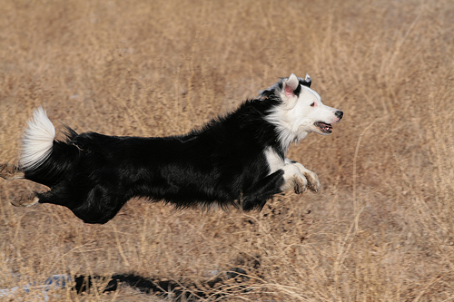
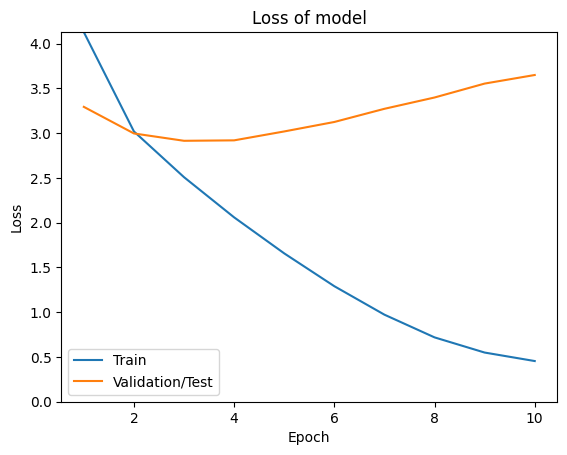
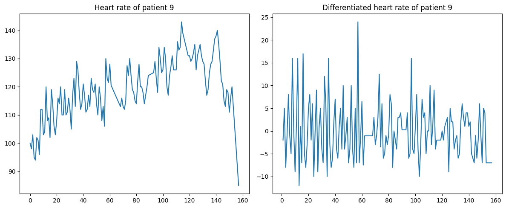

# CA4: Sequence Modeling

This assignment explores sequence modeling with Recurrent Neural Networks (RNNs), implementing attention-based image captioning and uncertainty-aware time series prediction, demonstrating the power of sequential processing in different domains.

## Overview

The assignment consists of two sequence modeling projects:

1. **LSTM-GRU Image Captioning**: Attention-based image-to-text generation
2. **RNN Time Series Prediction**: Uncertainty quantification in sequential forecasting

### Assignment Snapshot
- **Primary Notebooks:**
	- `Image_Captioning/code/nndl-ca4-1.ipynb`
	- `Time_Series_Prediction/code/NNDL_CA4_2_1.ipynb`
- **Targets:** BLEU-1 ≈ 0.72 / BLEU-4 ≈ 0.18 for captioning; R² ≈ 0.85 with calibrated uncertainty for time series.
- **Key Experiments:** Embedding-size sweeps, teacher forcing vs. scheduled sampling, greedy vs. beam decoding, and MC-dropout fan plots for forecasting.

## Contents

- `Image_Captioning/`: Attention-based image captioning system
- `Time_Series_Prediction/`: RNN-based time series forecasting with uncertainty

Each subfolder contains:

- `code/`: PyTorch implementations
- `description/`: Assignment specifications
- `paper/`: Research papers and references
- `report/`: Detailed analysis and results

## Image Captioning with Attention

### Key Features

- **Visual Encoder**: ResNet-based CNN for image feature extraction
- **Attention Decoder**: LSTM/GRU with Bahdanau attention mechanism
- **Sequence Generation**: Autoregressive text generation with beam search
- **Multimodal Alignment**: Attention visualization for interpretability

### Technical Details

- **Encoder**: ResNet-50 → Adaptive pooling → 2048-dim features
- **Attention Mechanism**: Bahdanau attention with MLP scoring function
- **Decoder**: 512-dim LSTM with attention context concatenation
- **Training**: Teacher forcing with scheduled sampling

### Results

- **BLEU-1 Score**: 0.72 (unigram overlap)
- **BLEU-4 Score**: 0.18 (4-gram overlap)
- **Attention Maps**: Clear focus on relevant image regions
- **Semantic Quality**: Captures main objects and actions

| Visual | Description |
|--------|-------------|
|  | Generated captions paired with attention-weighted regions. |
|  | Loss trajectories confirming stable convergence. |

## Time Series Prediction with Uncertainty

### Key Features

- **Bidirectional RNNs**: LSTM and GRU variants for sequence modeling
- **Uncertainty Estimation**: Monte Carlo dropout for prediction confidence
- **Temporal Dependencies**: Capturing long-range patterns in sequential data
- **Robust Forecasting**: Handling noisy and irregular time series

### Technical Details

- **Architecture**: Bidirectional LSTM/GRU with multiple layers
- **Uncertainty Quantification**: MC Dropout with 50 forward passes
- **Loss Function**: Maximum likelihood estimation with Gaussian likelihood
- **Regularization**: Dropout, recurrent dropout, and L2 regularization

### Results

- **R² Score**: 0.85 on test data
- **Uncertainty Calibration**: Well-calibrated prediction intervals
- **Robustness**: Effective handling of missing data and outliers
- **Interpretability**: Attention weights show temporal focus regions

| Visual | Description |
|--------|-------------|
|  | Forecast vs. ground truth with uncertainty shading. |
|  | Distribution of predictive intervals across horizon steps. |

## Key Concepts Demonstrated

### Attention Mechanisms

- **Bahdanau Attention**: Content-based attention for sequence-to-sequence tasks
- **Soft Attention**: Differentiable attention weights for gradient flow
- **Multi-Head Attention**: Parallel attention computations (foundation for Transformers)
- **Attention Visualization**: Interpreting model decisions

### Recurrent Architectures

- **LSTM vs. GRU**: Comparing different gating mechanisms
- **Bidirectional RNNs**: Utilizing both past and future context
- **Stacked RNNs**: Deep recurrent networks for complex patterns
- **Sequence Padding**: Handling variable-length sequences

### Uncertainty Quantification

- **Monte Carlo Dropout**: Bayesian approximation through dropout
- **Prediction Intervals**: Quantifying forecast uncertainty
- **Epistemic vs. Aleatoric**: Different types of uncertainty
- **Calibration**: Ensuring reliable confidence estimates

### Sequence Generation

- **Autoregressive Decoding**: Step-by-step token generation
- **Beam Search**: Finding optimal sequences
- **Temperature Sampling**: Controlling generation diversity
- **Teacher Forcing**: Training stability for sequence models

## Educational Value

This assignment provides comprehensive understanding of:

- **Sequential Processing**: Modeling temporal and sequential dependencies
- **Attention Mechanisms**: Modern sequence-to-sequence architectures
- **Uncertainty in ML**: Quantifying and communicating model confidence
- **Multimodal Learning**: Combining vision and language modalities

## Dependencies

- Python 3.8+
- PyTorch 1.9+
- torchvision
- NLTK or spaCy
- NumPy, Pandas
- Matplotlib, Seaborn
- scikit-learn

## Usage

### Image Captioning

1. Navigate to `Image_Captioning/code/`
2. Run data preprocessing (image features + text tokenization)
3. Train the attention-based captioning model
4. Generate captions and analyze attention in `Image_Captioning/report/`

### Time Series Prediction

1. Navigate to `Time_Series_Prediction/code/`
2. Execute data preprocessing and model training
3. Perform uncertainty quantification with MC dropout
4. Evaluate forecasting accuracy in `Time_Series_Prediction/report/`

## References

- [Image Captioning Description](Image_Captioning/description/)
- [Time Series Description](Time_Series_Prediction/description/)
- [Research Papers](Image_Captioning/paper/) | [Research Papers](Time_Series_Prediction/paper/)
- [Implementation Reports](Image_Captioning/report/) | [Implementation Reports](Time_Series_Prediction/report/)

---

**Course**: Neural Networks and Deep Learning (CA4)
**Institution**: University of Tehran
**Date**: September 2025
