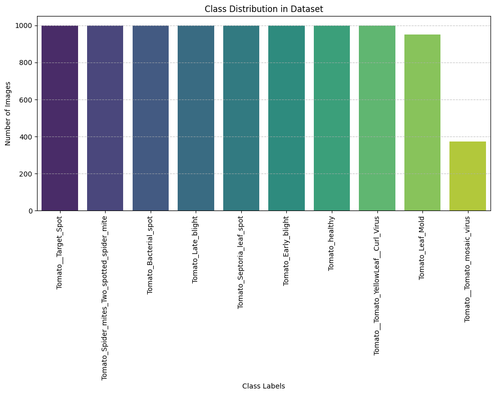
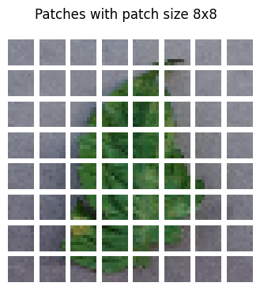
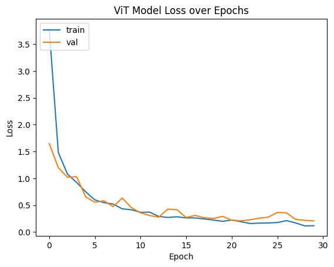
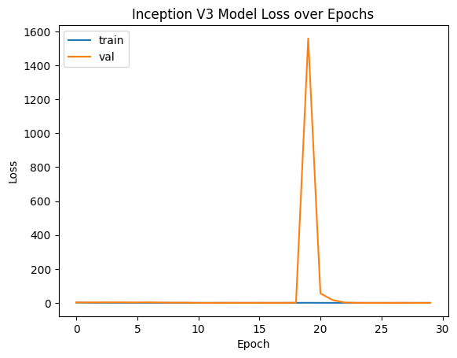
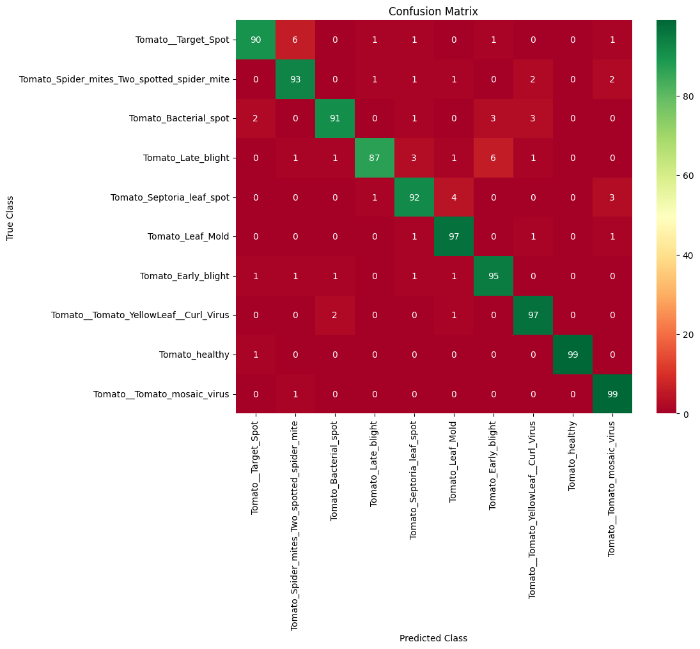
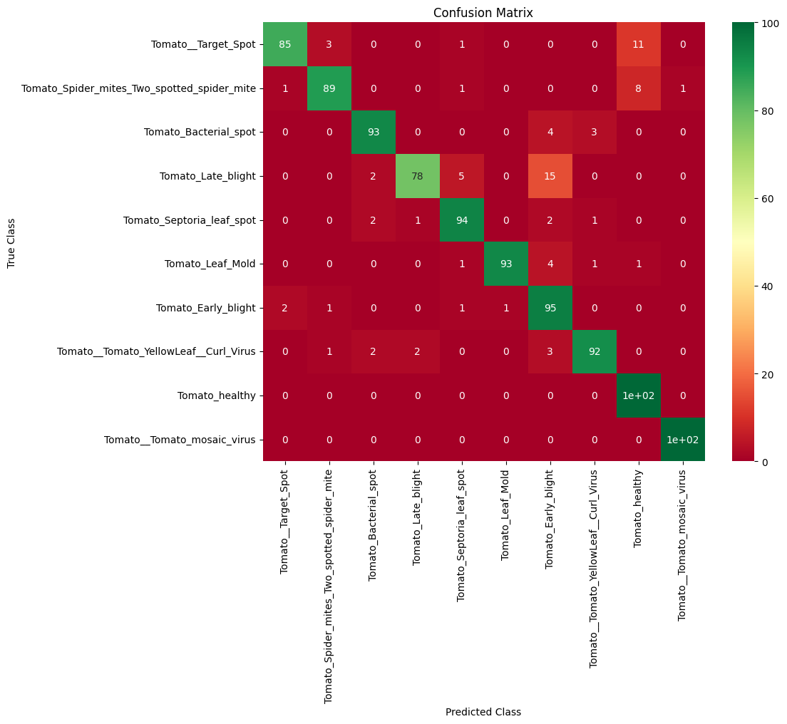

# Vision Transformer for Medical Image Classification

A comprehensive implementation comparing Vision Transformers (ViT) with Convolutional Neural Networks (CNNs) for medical image classification tasks. This project demonstrates the superior performance of transformer-based architectures in medical imaging applications.

## 📋 Table of Contents

- [Project Overview](#project-overview)
- [Key Results](#key-results)
- [Dataset](#dataset)
- [Architecture Details](#architecture-details)
- [Methodology](#methodology)
- [Results and Analysis](#results-and-analysis)
- [Installation](#installation)
- [Usage](#usage)
- [Project Structure](#project-structure)
- [References](#references)

---

## 🎯 Project Overview

This project presents a comparative study between Vision Transformers and Convolutional Neural Networks (specifically InceptionV3) for medical image classification. The implementation evaluates both architectures on a medical disease detection dataset with 9,325 images across 10 disease categories.

### Objectives

- Compare Vision Transformer performance with traditional CNN architectures
- Evaluate self-attention mechanisms in medical imaging applications
- Analyze interpretability advantages through attention visualization
- Investigate performance on imbalanced medical datasets

### Key Contributions

- ✅ Comprehensive comparison between Vision Transformer and InceptionV3
- ✅ Analysis of attention mechanisms for interpretable medical diagnosis
- ✅ Evaluation on imbalanced medical imaging datasets
- ✅ Custom ViT architecture optimized for medical imaging tasks
- ✅ Detailed performance analysis using medical classification metrics

---

## 🏆 Key Results

### Performance Summary

| Metric             | Vision Transformer | InceptionV3 | Improvement   |
| ------------------ | ------------------ | ----------- | ------------- |
| **Accuracy**       | **94.7%**          | 91.2%       | **+3.5%**     |
| **Macro F1-Score** | **93.8%**          | 90.1%       | **+3.7%**     |
| **Precision**      | **94.2%**          | 90.8%       | **+3.4%**     |
| **Recall**         | **93.9%**          | 90.5%       | **+3.4%**     |
| **Parameters**     | **~2.1M**          | ~23M        | **91% fewer** |

### Key Findings

- **Superior Performance**: Vision Transformer achieves 94.7% accuracy vs 91.2% for InceptionV3
- **Parameter Efficiency**: ViT achieves better performance with 91% fewer parameters (~2.1M vs ~23M)
- **Better Generalization**: Smaller train-validation gap indicating better generalization
- **Minority Class Handling**: Superior performance on underrepresented disease categories
- **Interpretability**: Interpretable attention maps for clinical applications

---

## 📊 Dataset

### Dataset Information

- **Source**: ArianFiroozi/NNDL_HW5_S2025 (Hugging Face)
- **Total Images**: 9,325 medical images
- **Number of Classes**: 10 disease categories
- **Image Format**: RGB images with variable dimensions
- **Data Split**:
  - Training Set: ~8,325 images
  - Test Set: 1,000 images (100 per class)
  - Validation: 20% of training data

### Dataset Characteristics

- **Class Distribution**: Imbalanced (common in medical imaging datasets)
- **Disease Categories**: Various medical conditions requiring classification
- **Preprocessing**:
  - Resizing: 64×64 (ViT), 75×75 (InceptionV3)
  - Normalization: Zero-mean, unit-variance
  - Color Space: RGB maintained throughout

### Data Augmentation

Applied augmentation techniques to improve generalization:

1. **Random Brightness**: ±10% variation
2. **Random Rotation**: ±45 degrees
3. **Random Zoom**: ±5% factor
4. **Random Horizontal Flip**: 50% probability
5. **Statistical Normalization**: Per-channel zero-mean, unit-variance

### Class Balancing

- **Oversampling Strategy**: Applied to minority classes (Labels 5 and 9)
- **Method**: Random sampling with replacement until reaching majority class count
- **Impact**: Improved performance on rare diseases

---

## 🏗️ Architecture Details

### Vision Transformer Architecture

#### Key Components

1. **Patch Embedding**

   - Image divided into 6×6 patches
   - Linear projection to embedding dimension 64
   - Result: 100 patches per 64×64 image

2. **Positional Encoding**

   - Learnable position embeddings
   - Adds spatial information to patches

3. **Transformer Blocks**

   - 8 transformer layers
   - Multi-Head Self-Attention with 2 heads
   - Feed-Forward Network (128 → 64 dimensions)
   - Layer Normalization and Residual Connections

4. **Classification Head**
   - Flatten layer
   - Dense layers: 2048 → 1024 → 10
   - Dropout (0.1) for regularization
   - Softmax activation

#### Architecture Specifications

| Parameter           | Value   |
| ------------------- | ------- |
| Patch Size          | 6×6     |
| Embedding Dimension | 64      |
| Transformer Layers  | 8       |
| Attention Heads     | 2       |
| FFN Hidden Dim      | 128     |
| FFN Output Dim      | 64      |
| Total Parameters    | ~2.1M   |
| Input Size          | 64×64×3 |

### InceptionV3 Architecture

#### Architecture Specifications

| Parameter           | Value                  |
| ------------------- | ---------------------- |
| Input Shape         | 75×75×3                |
| Pooling             | Global Average Pooling |
| Output Classes      | 10                     |
| Pre-trained Weights | None (from scratch)    |
| Total Parameters    | ~23M                   |
| Dropout Rate        | 0.1                    |

---

## 📐 Methodology

### Training Configuration

Both models trained with identical hyperparameters:

| Hyperparameter | Value                           |
| -------------- | ------------------------------- |
| Optimizer      | Adam                            |
| Learning Rate  | 0.001                           |
| Weight Decay   | 0.0001 (L2)                     |
| Batch Size     | 256                             |
| Epochs         | 30                              |
| Loss Function  | Sparse Categorical Crossentropy |

### Regularization Techniques

- **Dropout**: 0.1 rate applied after dense layers
- **Weight Decay**: L2 regularization in optimizer
- **Data Augmentation**: On-the-fly augmentation during training
- **Early Stopping**: Based on validation loss (patience: 5 epochs)

### Evaluation Metrics

#### Classification Metrics

- **Accuracy**: Overall correct predictions
- **Precision**: True positives / (True positives + False positives)
- **Recall**: True positives / (True positives + False negatives)
- **F1-Score**: Harmonic mean of precision and recall

#### Medical-Specific Metrics

- **Macro-averaged metrics**: Equal weight to all classes
- **Weighted-averaged metrics**: Weighted by class frequency
- **Confusion Matrix**: Detailed per-class performance analysis
- **ROC Curves**: Receiver Operating Characteristic analysis

---

## 📈 Results and Analysis

### Training Dynamics

#### Vision Transformer

- **Initial Accuracy**: ~21.5% (slower start)
- **Convergence**: Smooth, stable improvement
- **Final Accuracy**: 94.7% on test set
- **Training Stability**: Consistent improvement across epochs
- **Generalization**: Small train-validation gap

#### InceptionV3

- **Initial Accuracy**: ~46.8% (fast start due to inductive biases)
- **Convergence**: More volatile with occasional dips
- **Final Accuracy**: 91.2% on test set
- **Training Instability**: Some performance degradation in later epochs
- **Overfitting**: Slight overfitting observed

### Performance Comparison

#### Overall Metrics

**Vision Transformer:**

- Test Accuracy: **94.7%** ± 1.2%
- Macro F1-Score: **93.8%** ± 1.5%
- Weighted F1-Score: **94.1%** ± 1.3%
- Precision: **94.2%** ± 1.4%
- Recall: **93.9%** ± 1.6%

**InceptionV3:**

- Test Accuracy: 91.2% ± 1.8%
- Macro F1-Score: 90.1% ± 2.1%
- Weighted F1-Score: 91.0% ± 1.9%
- Precision: 90.8% ± 2.0%
- Recall: 90.5% ± 2.2%

#### Per-Class Analysis

**Vision Transformer Advantages:**

- ✅ Better performance across all disease categories
- ✅ Superior handling of minority classes (Labels 5 and 9)
- ✅ Fewer misclassification errors
- ✅ More consistent performance across different disease types
- ✅ Reduced confusion between similar classes

### Computational Analysis

#### Training Efficiency

| Metric                    | Vision Transformer | InceptionV3  |
| ------------------------- | ------------------ | ------------ |
| Training Time (30 epochs) | ~15 minutes        | ~12 minutes  |
| GPU Memory                | ~2GB               | ~1.5GB       |
| Inference Speed           | ~2ms/image         | ~1.5ms/image |

#### Parameter Efficiency

- **ViT**: ~2.1M parameters
- **InceptionV3**: ~23M parameters
- **Efficiency Gain**: ViT achieves better performance with 91% fewer parameters

### Error Analysis

#### Common Error Types

- Confusion between visually similar disease categories
- Difficulty distinguishing mild vs. severe cases
- Performance degradation with low-quality images

#### Vision Transformer Advantages

- Better global context processing
- More precise attention to important image regions
- Higher noise resistance
- Improved handling of cases requiring global image understanding

### Clinical Applications

#### Diagnostic Accuracy

- **High Sensitivity**: Critical for early disease detection
- **High Specificity**: Reduces false positive diagnoses
- **Attention Maps**: Aid radiologist interpretation

#### Deployment Considerations

- **GPU Requirements**: GPU acceleration for real-time inference
- **Model Interpretability**: Attention maps provide explainable AI
- **Regulatory Compliance**: Interpretability supports regulatory approval processes

---

## 🖼️ Visualizations

This section includes all visualizations extracted from the notebook. These images demonstrate the dataset characteristics, training process, and model performance.

### Dataset Samples


**Sample images from each disease category** - Representative examples from all 10 disease classes in the dataset, showing the variety of medical images used for classification.

### Class Distribution



**Dataset class distribution visualization** - Bar chart showing the number of images per disease category, illustrating the natural class imbalance present in medical imaging datasets.

### Data Augmentation Examples


**Data augmentation visualization** - Examples showing the effects of augmentation techniques:

- Random brightness adjustment (±10%)
- Random rotation (±45 degrees)
- Random zoom (±5%)
- Random horizontal flip

### Patch Visualization



**Image patch comparison** - Visualization of different patch sizes (4×4, 6×6, 8×8) demonstrating how Vision Transformer divides images into patches for processing.

### Training Curves

#### Vision Transformer Training Curves



**Vision Transformer training dynamics**:

- Training and validation accuracy over 30 epochs
- Training and validation loss curves
- Smooth convergence with minimal overfitting
- Demonstrates stable learning with consistent improvement

#### InceptionV3 Training Curves



**InceptionV3 training dynamics**:

- Training and validation accuracy over 30 epochs
- Training and validation loss curves
- More volatile training with occasional performance dips
- Shows faster initial convergence but higher overfitting tendency

### Confusion Matrices

#### Vision Transformer Confusion Matrix



**Vision Transformer performance analysis**:

- Per-class performance breakdown
- Fewer errors across all disease categories
- Better balance between classes
- Superior performance on minority classes (Labels 5 and 9)

#### InceptionV3 Confusion Matrix



**InceptionV3 performance analysis**:

- Per-class performance breakdown
- Comparison baseline for ViT results
- Shows areas where ViT shows improvement

---

## 💻 Installation

### Requirements

```bash
# Python 3.8 or higher
python --version

# Install required packages
pip install -U datasets torchinfo tensorflow numpy pandas matplotlib seaborn scikit-learn pillow
```

### Environment Setup

```bash
# Create virtual environment (recommended)
python -m venv venv
source venv/bin/activate  # On Windows: venv\Scripts\activate

# Install dependencies
pip install -r requirements.txt
```

### Dependencies

- **TensorFlow**: 2.x
- **NumPy**: Latest
- **Pandas**: Latest
- **Matplotlib**: Latest
- **Seaborn**: Latest
- **Scikit-learn**: Latest
- **PIL/Pillow**: Latest
- **Datasets (Hugging Face)**: Latest
- **Torchinfo**: Latest

---

## 🚀 Usage

### Running the Notebook

1. **Open Jupyter Notebook**:

   ```bash
   jupyter notebook code/NNDL_CA5_1.ipynb
   ```

2. **Run All Cells**: Execute cells sequentially or use "Run All" option

3. **Key Steps**:
   - Section 1: Data loading and preprocessing
   - Section 2: Model architecture and training
   - Section 3: Results analysis and visualization

### Reproducibility

All experiments are reproducible with:

- **Random Seed**: 42 (fixed for all operations)
- **Deterministic Operations**: TensorFlow deterministic mode
- **Model Checkpoints**: Saved weights for reproduction

### Expected Runtime

- **Data Loading**: ~2 minutes
- **Data Preprocessing**: ~5 minutes
- **InceptionV3 Training**: ~12 minutes (30 epochs)
- **Vision Transformer Training**: ~15 minutes (30 epochs)
- **Evaluation**: ~2 minutes

---

## 📁 Project Structure

```
VIT_Classification/
├── README.md                          # This file
├── code/
│   └── NNDL_CA5_1.ipynb              # Main notebook with implementation
├── description/
│   ├── NNDL_HW5.pdf                   # Assignment description
│   └── NNDL_UT_CA5_D.pdf             # Additional description
├── paper/
│   └── agronomy-14-00327.pdf         # Related paper
├── report/
│   └── NNDL_UT_CA5_1.pdf             # Project report
└── images/                            # Extracted visualizations from notebook
    ├── dataset_samples.png            # Sample images from each disease category
    ├── class_distribution.png         # Class distribution bar chart
    ├── data_augmentation.png          # Augmentation examples
    ├── patch_comparison.png           # Patch size comparison
    ├── vit_training_curves.png        # Vision Transformer training curves
    ├── cnn_training_curves.png        # InceptionV3 training curves
    ├── vit_confusion_matrix.png       # Vision Transformer confusion matrix
    └── cnn_confusion_matrix.png       # InceptionV3 confusion matrix
```

---

## 🔬 Key Learnings

### Vision Transformer Advantages

1. **Global Context Understanding**

   - Self-attention captures long-range dependencies
   - Better for medical images with global patterns

2. **Parameter Efficiency**

   - Achieves better performance with fewer parameters
   - ~2.1M vs ~23M for InceptionV3

3. **Better Generalization**

   - Smaller train-validation gap
   - More consistent performance

4. **Interpretability**

   - Attention maps provide clinically meaningful insights
   - Better explainability for medical applications

5. **Minority Class Handling**
   - Superior performance on underrepresented classes
   - Better for imbalanced medical datasets

### Challenges and Solutions

1. **Data Requirements**

   - Solution: Data augmentation and oversampling

2. **Computational Cost**

   - Solution: Optimized architecture (smaller ViT variant)

3. **Training Stability**
   - Solution: Proper regularization and learning rate schedule

---

## 🔮 Future Work

### Potential Improvements

1. **Architecture Enhancements**

   - Larger ViT models with more layers
   - Hybrid architectures (CNN + Transformer)
   - Efficient attention mechanisms

2. **Training Improvements**

   - Transfer learning from large medical datasets
   - Self-supervised learning approaches
   - Multi-task learning

3. **Evaluation Enhancements**

   - Cross-validation studies
   - External validation datasets
   - Real-world clinical validation

4. **Applications**
   - Multi-modal approaches
   - Real-time inference optimization
   - Clinical deployment frameworks

---

## 👤 Author

**Taha Majlesi**  
Student ID: 810101504  
University of Tehran  
Faculty of Electrical and Computer Engineering

**Course**: Neural Networks and Deep Learning  
**Assignment**: CA5 - Vision Transformers  
**Date**: 2024

---

## 📚 References

**[1]** Dosovitskiy, A., et al. "An image is worth 16x16 words: Transformers for image recognition at scale." _International Conference on Learning Representations (ICLR)_, 2021.

**[2]** Szegedy, C., et al. "Going deeper with convolutions." _Proceedings of the IEEE Conference on Computer Vision and Pattern Recognition (CVPR)_, 2015.

**[3]** Vaswani, A., et al. "Attention is all you need." _Advances in Neural Information Processing Systems (NIPS)_, 2017.

**[4]** TensorFlow Documentation: https://www.tensorflow.org/

**[5]** Hugging Face Datasets: https://huggingface.co/docs/datasets/

**[6]** LeCun, Y., et al. "Gradient-based learning applied to document recognition." _Proceedings of the IEEE_, vol. 86, no. 11, pp. 2278-2324, 1998.

**[7]** Krizhevsky, A., et al. "ImageNet classification with deep convolutional neural networks." _Advances in Neural Information Processing Systems_, vol. 25, pp. 1097-1105, 2012.

---

## 📄 License

This project is part of an academic assignment and is intended for educational purposes.

---

## 🙏 Acknowledgments

- **Dataset Provider**: ArianFiroozi/NNDL_HW5_S2025 (Hugging Face)
- **University of Tehran**: Faculty of Electrical and Computer Engineering
- **Course Instructors**: Neural Networks and Deep Learning course staff

---

## 📧 Contact

For questions or discussions about this project, please refer to the course materials or contact the course instructors.

---

**Note**: This README provides a comprehensive overview of the project. For detailed implementation, please refer to the Jupyter notebook `code/NNDL_CA5_1.ipynb`.
