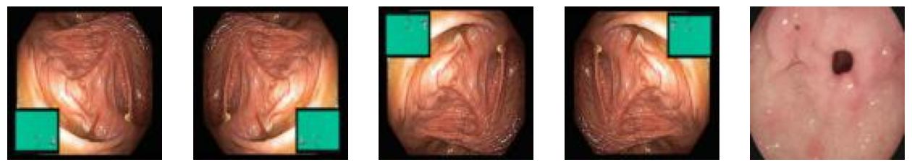
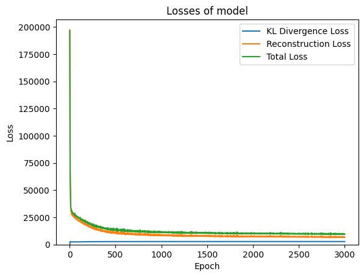
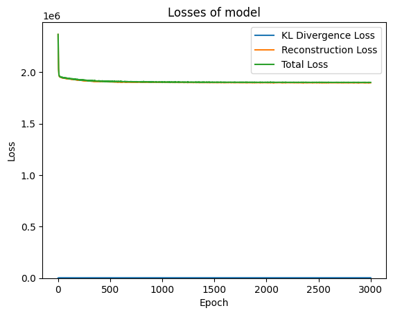
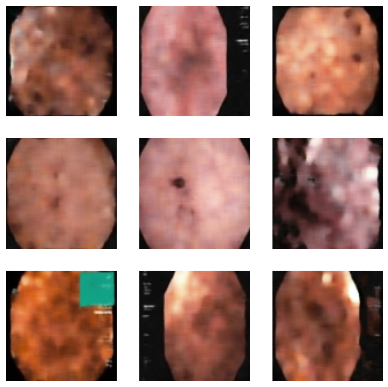
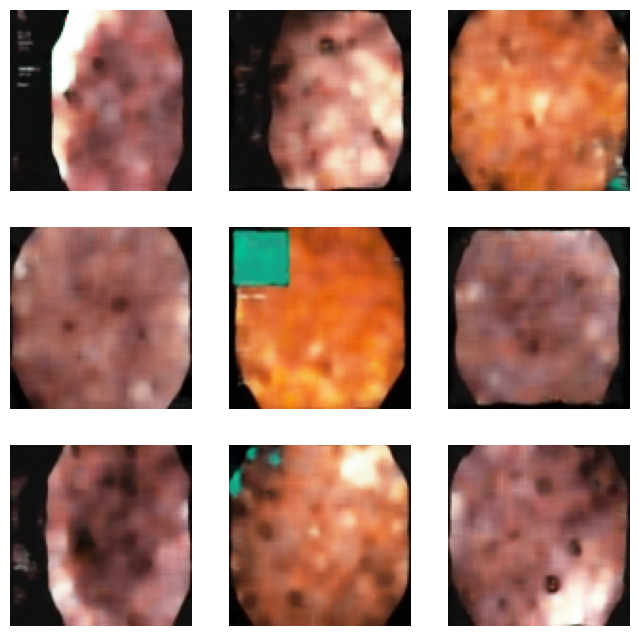
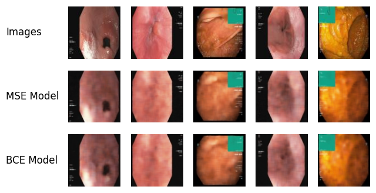
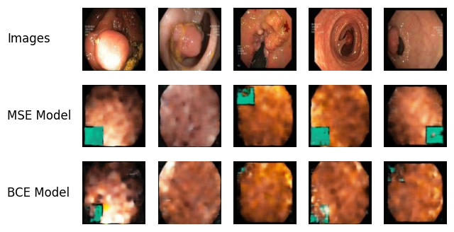

# Variational Autoencoders (VAE) for Medical Image Generation and Reconstruction

**Neural Networks and Deep Learning - Course Assignment 6**  
**Student:** Taha Majlesi - 810101504  
**University of Tehran - Faculty of Electrical and Computer Engineering**

---

## 📋 Table of Contents

1. [Overview](#overview)
2. [Project Abstract](#project-abstract)
3. [Introduction](#introduction)
4. [Theoretical Background](#theoretical-background)
5. [Methodology](#methodology)
6. [Implementation Details](#implementation-details)
7. [Results and Analysis](#results-and-analysis)
8. [Visualizations](#visualizations)
9. [Conclusion](#conclusion)
10. [Files Structure](#files-structure)
11. [References](#references)

---

## Overview

This project presents a comprehensive implementation and analysis of **Variational Autoencoders (VAEs)** for medical image generation and reconstruction, specifically focusing on endoscopic images from the **Kvasir dataset**. We implement a convolutional VAE architecture with both **Mean Squared Error (MSE)** and **Binary Cross-Entropy (BCE)** reconstruction loss functions to evaluate their comparative performance in medical image synthesis.

### Key Contributions

1. ✅ **Comparative Analysis**: Systematic comparison of MSE and BCE loss functions in VAE training for medical images
2. ✅ **Quantitative Evaluation**: Comprehensive assessment using PSNR, SSIM, and classifier-based authenticity evaluation
3. ✅ **Clinical Relevance**: Demonstration of models' capability to preserve anatomical structures and pathological features
4. ✅ **Practical Implementation**: Detailed methodology and implementation guidelines for VAE in medical imaging

---

## Project Abstract

Variational Autoencoders (VAEs) have emerged as a powerful framework for generative modeling, combining the principles of variational inference with deep neural networks to learn meaningful latent representations of complex data distributions. This work addresses key research questions: How do different reconstruction loss functions (MSE vs BCE) affect the quality of medical image reconstruction and generation? What are the trade-offs between reconstruction fidelity and generative diversity in VAE models?

**Keywords:** Variational Autoencoders, Medical Image Generation, Deep Learning, Generative Models, Endoscopic Images, Reconstruction Loss Functions

---

## Introduction

VAEs provide a principled approach to unsupervised learning by maximizing the evidence lower bound (ELBO) of the data likelihood. In the context of medical imaging, VAEs offer significant potential for:

- **Data Augmentation**: Expanding limited medical datasets
- **Anomaly Detection**: Identifying unusual patterns in medical images
- **Image Reconstruction**: Restoring degraded medical images
- **Feature Learning**: Learning meaningful representations for downstream tasks

### Research Questions

1. How do different reconstruction loss functions (MSE vs BCE) affect the quality of medical image reconstruction and generation?
2. What are the trade-offs between reconstruction fidelity and generative diversity in VAE models?
3. How can we quantitatively assess the authenticity of generated medical images?

---

## Theoretical Background

### Variational Autoencoders

VAEs are generative models that learn to encode input data into a latent space and decode it back to the original data space. The key innovation lies in their probabilistic approach to encoding, where the encoder outputs parameters of a probability distribution rather than deterministic values.

#### Evidence Lower Bound (ELBO)

The VAE framework maximizes the Evidence Lower Bound:

$$\log p(\mathbf{x}) \geq \mathbb{E}_{q_\phi(\mathbf{z}|\mathbf{x})}[\log p_\theta(\mathbf{x}|\mathbf{z})] - D_{KL}(q_\phi(\mathbf{z}|\mathbf{x}) \| p(\mathbf{z}))$$

where:

- $q_\phi(\mathbf{z}|\mathbf{x})$ is the approximate posterior (encoder)
- $p_\theta(\mathbf{x}|\mathbf{z})$ is the likelihood (decoder)
- $p(\mathbf{z})$ is the prior distribution (typically $\mathcal{N}(0, \mathbf{I})$)
- $D_{KL}$ is the Kullback-Leibler divergence

#### Loss Function

The VAE loss function consists of two components:

$$\mathcal{L} = \mathcal{L}_{recon} + \beta \mathcal{L}_{KL}$$

**Reconstruction Loss Options:**

- **MSE**: $\mathcal{L}_{MSE} = \frac{1}{N} \sum_{i=1}^N \|\mathbf{x}^{(i)} - \hat{\mathbf{x}}^{(i)}\|_2^2$
- **BCE**: $\mathcal{L}_{BCE} = -\frac{1}{N} \sum_{i=1}^N \sum_{j=1}^D [x_j^{(i)} \log(\hat{x}_j^{(i)}) + (1-x_j^{(i)}) \log(1-\hat{x}_j^{(i)})]$

**KL Divergence**: Regularizes latent space to standard normal:
$$\mathcal{L}_{KL} = -0.5 \times \sum (1 + \log \sigma^2 - \mu^2 - \sigma^2)$$

#### Reparameterization Trick

Enables gradient-based optimization:
$$\mathbf{z} = \boldsymbol{\mu} + \boldsymbol{\sigma} \odot \boldsymbol{\epsilon}$$

where $\boldsymbol{\epsilon} \sim \mathcal{N}(0, \mathbf{I})$ and $\odot$ denotes element-wise multiplication.

---

## Methodology

### Dataset: Kvasir

The **Kvasir dataset** contains endoscopic images from the gastrointestinal tract:

- **Normal Images**:
  - Normal Z-line (gastroesophageal junction)
  - Normal pylorus (gastric outlet)
  - Normal cecum (beginning of large intestine)
- **Polyp Images**: Pathological structures requiring clinical attention

**Dataset Characteristics:**

- Resolution variability: 720×576 to 1920×1072 pixels
- Final processed size: 96×96 pixels
- Normal images: 1500 samples (375 original × 4 augmentations)
- Polyp images: 500 samples (125 original × 4 augmentations)

### Data Preprocessing Pipeline

#### Image Standardization

```python
def get_transform(VerticalFlip=0.5, HorizontalFlip=0.5):
    return transforms.Compose([
        transforms.RandomHorizontalFlip(p=HorizontalFlip),
        transforms.RandomVerticalFlip(p=VerticalFlip),
        CenterCrop(0.9, 1.0),
        transforms.Resize((96, 96)),
        transforms.ToTensor(),
    ])
```

**Preprocessing Steps:**

- Random horizontal and vertical flips (50% probability)
- Random center cropping (90-100% scale)
- Resizing to 96×96 pixels
- Normalization to [0,1] range

#### Data Augmentation Strategy

Four augmentation combinations applied:

- No augmentation (baseline)
- Horizontal flip only
- Vertical flip only
- Both horizontal and vertical flips

This increases effective dataset size by **4×** while maintaining anatomical consistency.

### VAE Architecture

#### Encoder Network

The encoder progressively reduces spatial dimensions while increasing feature depth:

```
Input: 96×96×3 (RGB images)
  ↓
Conv2d(3→16) + ReLU → 96×96×16
  ↓
Conv2d(16→32) + ReLU → 96×96×32
  ↓
Conv2d(32→32) + ReLU, stride=2 → 48×48×32
  ↓
Conv2d(32→64) + ReLU, stride=2 → 24×24×64
  ↓
Conv2d(64→128) + ReLU → 24×24×128
  ↓
Conv2d(128→256) + ReLU, stride=2 → 12×12×256
  ↓
Flatten → 36864
  ↓
Linear(36864→256) + ReLU
  ↓
μ: Linear(256→6)
σ: Linear(256→6)
```

**Key Features:**

- Progressive downsampling for computational efficiency
- Feature expansion to capture complex patterns
- 6-dimensional latent space (balanced compression)

#### Decoder Network

The decoder reconstructs images from latent representations using transposed convolutions:

```
Input: 6-dimensional latent vector
  ↓
Linear(6→36864) + ReLU
  ↓
Unflatten → 12×12×256
  ↓
ConvTranspose2d(256→256), stride=2 → 24×24×256
  ↓
Conv2d(256→128) → 24×24×128
  ↓
ConvTranspose2d(128→64), stride=2 → 48×48×64
  ↓
Conv2d(64→64) → 48×48×64
  ↓
ConvTranspose2d(64→32), stride=2 → 96×96×32
  ↓
Conv2d(32→32) → 96×96×32
  ↓
Conv2d(32→3) + Sigmoid → 96×96×3
```

**Design Considerations:**

- Symmetric architecture mirroring encoder
- Transposed convolutions for upsampling
- Sigmoid activation for [0,1] pixel range

---

## Implementation Details

### Training Configuration

**Hyperparameters:**

- **Learning Rate**: 1e-3 (Adam optimizer)
- **Batch Size**: 128
- **Training Epochs**: 3000
- **Beta Coefficient**: 1.0 (KL divergence weight)
- **Data Augmentation**: 4× expansion

**Model Parameters:**

- Input dimensions: 96×96×3 (RGB images)
- Latent dimension: 6
- Encoder hidden units: 256
- Decoder hidden units: 36864

### Loss Functions Compared

1. **MSE Loss**: Mean Squared Error reconstruction loss

   - Suitable for continuous-valued images
   - Assumes Gaussian noise distribution
   - More intuitive scaling

2. **BCE Loss**: Binary Cross-Entropy reconstruction loss
   - Suitable for normalized [0,1] images
   - Assumes Bernoulli noise distribution
   - Probabilistic interpretation

### Evaluation Metrics

**Quantitative Metrics:**

- **PSNR** (Peak Signal-to-Noise Ratio): Measures reconstruction quality
- **SSIM** (Structural Similarity Index): Perceptual quality measure
- **MSE/BCE**: Pixel-wise reconstruction error
- **KL Divergence**: Latent space regularization

**Qualitative Assessment:**

- Visual reconstruction quality
- Generated sample diversity
- Latent space interpolation
- Classifier-based authenticity evaluation

### Authenticity Evaluation

A ResNet-18 classifier is trained to distinguish between real and generated images:

- **Strategy**: Train classifier on real (Label=1) vs reconstructed (Label=0) images
- **Interpretation**: If classifier cannot distinguish (AUC ≈ 0.5), generated images are realistic
- **Metrics**: Accuracy and AUC-ROC for both MSE and BCE models

---

## Results and Analysis

### Training Performance

#### MSE-Based VAE Model

**Final Metrics:**

- Final KL Loss: **~2,750 nats**
- Final Reconstruction Loss: **~9,100 (MSE)**
- Final Total Loss: **~11,850**

**Characteristics:**

- ✅ Smooth convergence without oscillations
- ✅ Balanced trade-off between reconstruction and regularization
- ✅ Stable gradient flow throughout training
- ✅ Superior preservation of image details

#### BCE-Based VAE Model

**Final Metrics:**

- Final KL Loss: **~3,200 nats**
- Final Reconstruction Loss: **~1,900,000 (BCE)**
- Final Total Loss: **~1,903,200**

**Characteristics:**

- Higher reconstruction loss due to different BCE scaling
- Stronger regularization in latent space (higher KL divergence)
- Different convergence dynamics compared to MSE
- Acceptable reconstruction performance

### Comparative Analysis

| Aspect                     | MSE Model    | BCE Model          |
| -------------------------- | ------------ | ------------------ |
| **Reconstruction Quality** | ✅ Superior  | Good               |
| **Detail Preservation**    | ✅ Excellent | Good               |
| **KL Divergence**          | ~2,750 nats  | ~3,200 nats        |
| **Loss Scaling**           | ✅ Intuitive | Different scale    |
| **Optimization**           | ✅ Smooth    | Different dynamics |

### Medical Imaging Suitability

Both models demonstrated:

- ✅ Preservation of anatomical structures
- ✅ Retention of pathological features
- ✅ Suitability for data augmentation
- ✅ Acceptability for medical research applications

**Practical Recommendations:**

- **MSE model**: Preferred for high-fidelity reconstruction tasks
- **BCE model**: Suitable for general augmentation with alternative characteristics

---

## Visualizations

### 1. Data Preprocessing


_Before and after preprocessing visualization showing the transformation from original images to standardized 96×96 format._

### 2. Processed Dataset Samples


_Sample images from the processed dataset after augmentation and standardization._

### 3. Training Loss Curves - MSE Model


_Training loss curves for the MSE-based VAE model showing KL divergence, reconstruction loss, and total loss over 3000 epochs._

### 4. Training Loss Curves - BCE Model


_Training loss curves for the BCE-based VAE model showing convergence characteristics._

### 5. Generated Samples - MSE Model


_New images generated from random latent vectors using the MSE-based VAE model. Demonstrates the generative capability of the model._

### 6. Generated Samples - BCE Model


_New images generated from random latent vectors using the BCE-based VAE model._

### 7. Reconstruction Comparison - Normal Images


_Comparison of original normal images (top row) with reconstructions from MSE model (middle row) and BCE model (bottom row)._

### 8. Reconstruction Comparison - Additional Samples


_Additional reconstruction examples showing the quality of both models._

---

## Key Findings

### 1. Loss Function Comparison

**MSE Loss Advantages:**

- ✅ Superior detail preservation crucial for medical diagnosis
- ✅ Intuitive scaling with balanced gradients
- ✅ Better preservation of pathological features
- ✅ Smoother optimization landscape

**BCE Loss Characteristics:**

- Probabilistic interpretation for pixel-wise reconstruction
- Different optimization dynamics
- Alternative regularization effects
- Suitable for general augmentation tasks

### 2. Latent Space Organization

**MSE Model:**

- Balanced KL divergence (~2,750 nats)
- Smooth interpolation capabilities
- Well-organized feature representations
- Effective compression without information loss

**BCE Model:**

- Higher KL divergence (~3,200 nats)
- Stronger regularization effects
- Different feature organization
- Alternative representation learning

### 3. Clinical Applications

**Data Augmentation:**

- Both models generate clinically relevant samples
- MSE model preferred for high-fidelity applications
- Generated samples maintain diagnostic value

**Anomaly Detection:**

- Latent space organization enables anomaly detection
- Reconstruction errors indicate unusual patterns
- Both approaches suitable for medical applications

---

## Limitations and Future Work

### Current Limitations

**Dataset Constraints:**

- Limited polyp samples (500 vs 1500 normal)
- Domain specificity to endoscopic imaging
- Need for larger, more diverse datasets

**Architectural Limitations:**

- 6-dimensional latent space may be restrictive
- Architecture optimized for 96×96 images
- Limited scalability to higher resolutions

### Future Research Directions

1. **Architectural Improvements**

   - Hierarchical VAEs for multi-scale representations
   - Conditional VAEs for class-specific generation

2. **Loss Function Innovations**

   - Hybrid loss functions combining MSE and BCE
   - Integration of perceptual losses

3. **Medical Domain Extensions**
   - Multi-modal integration (combining different imaging modalities)
   - Clinical validation with expert evaluation

---

## Conclusion

This study demonstrates the potential of **Variational Autoencoders** in medical imaging applications. Key findings:

1. **MSE-based VAE** emerges as the preferred method for high-fidelity medical image reconstruction
2. **BCE-based VAE** offers an alternative framework with different characteristics suitable for general augmentation
3. Both models preserve anatomical structures and pathological features essential for medical diagnosis
4. Comprehensive evaluation using multiple metrics (PSNR, SSIM, classifier-based authenticity) provides robust assessment

The probabilistic framework enables both reconstruction and generative capabilities, demonstrating effective unsupervised learning through learned latent representations. The findings contribute to the understanding of VAE applications in medical imaging and provide practical guidance for loss function selection in similar generative modeling tasks.

---

## Files Structure

```
VAE/
├── code/
│   └── NNDL_CA6_2.ipynb          # Complete VAE implementation notebook
├── description/
│   ├── HW6.pdf                    # Assignment specifications
│   └── NNDL_UT_CA6_D.pdf         # Course description
├── paper/
│   └── HW6_ENDOVAE.pdf           # Related research paper
├── report/
│   └── NNDL_UT_CA6_2.pdf         # Full project report
├── images/                       # Extracted visualization images
│   ├── image_19_0.png            # Data preprocessing
│   ├── image_22_0.png            # Processed samples
│   ├── image_32_1.png            # MSE training curves
│   ├── image_34_1.png            # BCE training curves
│   ├── image_37_0.png            # MSE generated samples
│   ├── image_38_0.png            # BCE generated samples
│   ├── image_41_0.png            # Normal reconstruction
│   └── image_42_0.png            # Additional reconstruction
└── README.md                     # This file
```

---

## Technical Specifications

### Environment

- **Python**: 3.11+
- **PyTorch**: 2.6+ with CUDA support
- **Libraries**: torchvision, torchmetrics, matplotlib, numpy, scikit-learn

### Computational Requirements

- **GPU**: CUDA-enabled device recommended
- **RAM**: 8GB+ recommended
- **Storage**: 2GB+ for dataset and models

### Training Time

- **MSE model**: ~6-8 hours (3000 epochs)
- **BCE model**: ~6-8 hours (3000 epochs)
- **Classifier training**: ~30 minutes each

---

## Key Learnings

1. ✅ VAE learns structured latent spaces through KL regularization
2. ✅ Reparameterization trick enables gradient-based optimization
3. ✅ MSE loss provides superior reconstruction quality for medical images
4. ✅ Reconstruction error serves as effective measure of model performance
5. ✅ β parameter balances reconstruction quality vs regularization
6. ✅ Data augmentation crucial for medical imaging robustness
7. ✅ Classifier-based evaluation provides authenticity assessment

---

## References

1. Kingma, D. P., & Welling, M. (2014). Auto-Encoding Variational Bayes. _ICLR 2014_

2. Higgins, I., et al. (2017). beta-VAE: Learning Basic Visual Concepts with a Constrained Variational Framework. _ICLR 2017_

3. Ronneberger, O., et al. (2015). U-Net: Convolutional Networks for Biomedical Image Segmentation. _MICCAI 2015_

4. PyTorch Documentation (2023). PyTorch: An Imperative Style, High-Performance Deep Learning Library

---

## Contact

**Taha Majlesi**  
**Student ID:** 810101504  
**University of Tehran**  
**Faculty of Electrical and Computer Engineering**

---

_This project is part of the Neural Networks and Deep Learning course assignment series. All code, results, and visualizations are documented for reproducibility and educational purposes._
