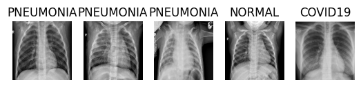
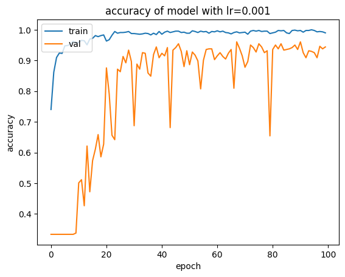
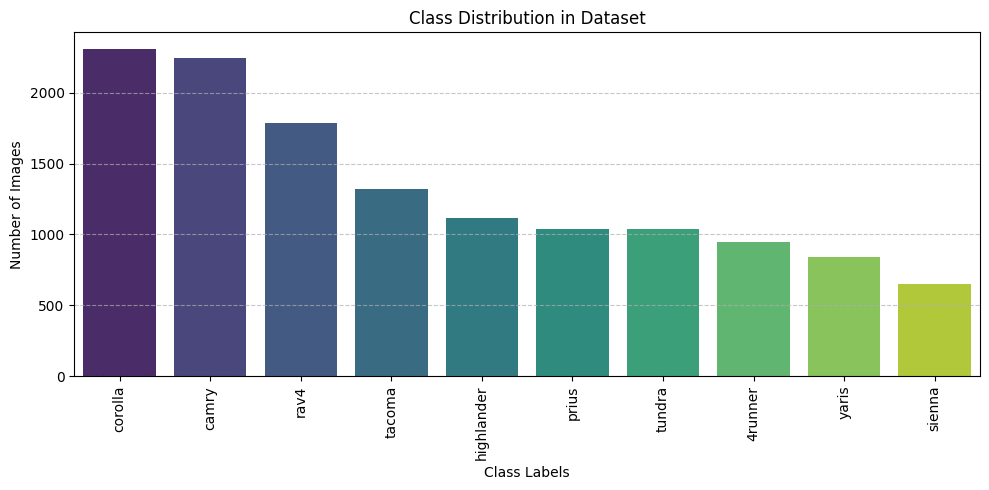
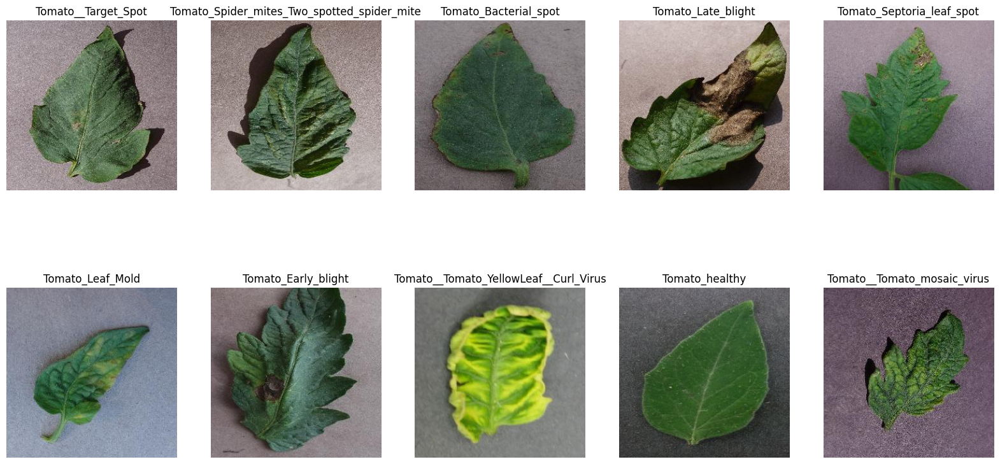
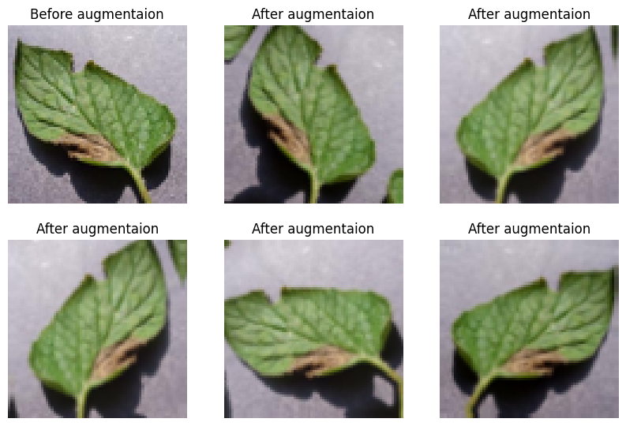
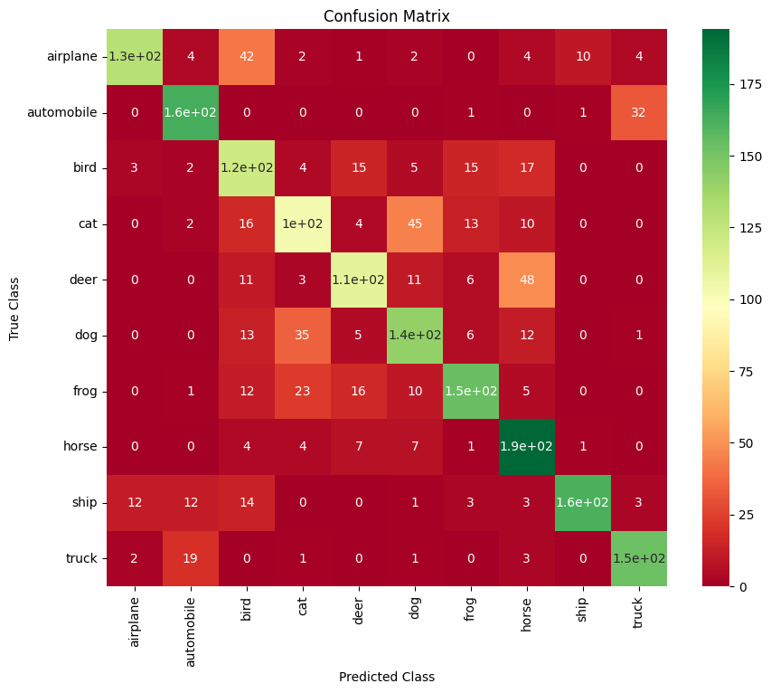
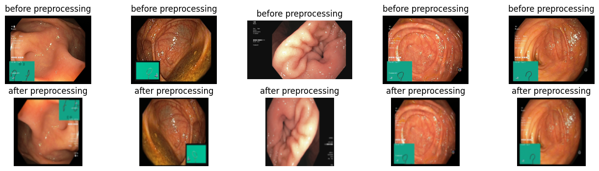
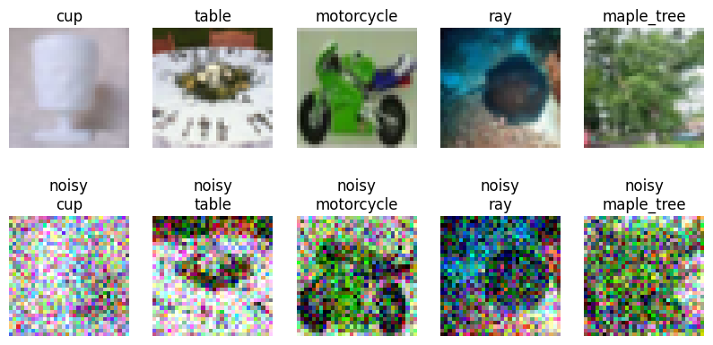
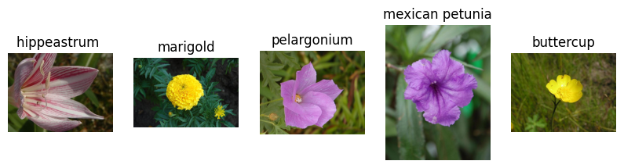

# Deep Learning Assignments Repository

[](https://www.python.org/)
[](https://pytorch.org/)
[](LICENSE)

This repository contains comprehensive implementations of advanced deep learning concepts and models as part of the Neural Networks and Deep Learning course assignments. Each assignment demonstrates practical applications of cutting-edge deep learning techniques with detailed mathematical formulations, architectural designs, and performance evaluations.

**📊 Total Notebooks**: 14 | **🖼️ Total Images Extracted**: 338 | **📁 Assignments**: 7

---
## 🧭 Table of Contents
1. [Repository Structure](#-repository-structure)
2. [Assignments Overview](#-assignments-overview)
3. [Key Technologies](#️-key-technologies-and-frameworks)
4. [Core Concepts](#-core-concepts-demonstrated)
5. [Getting Started](#-getting-started)
6. [Image Collection Summary](#-image-collection-summary)
7. [Datasets](#-datasets)
8. [Reproducibility](#-reproducibility)
9. [Experiment Management](#-experiment-management)
10. [Usage](#-usage)
11. [Troubleshooting](#-troubleshooting)
12. [FAQ](#-faq)
13. [Roadmap](#-roadmap)
14. [Citation](#-citation)
15. [License](#-license)
16. [Acknowledgments](#-acknowledgments)

> All image paths are relative and verified. If browsing on GitHub, images should render automatically. If any image fails to load locally, run `python extract_all_images.py` to regenerate notebook image outputs.

## 📋 Repository Structure
This section helps you quickly orient yourself in the project. Each top-level folder corresponds to a course assignment (CA1–CA7) or shared resources. Inside an assignment folder you will typically find:

- `code/` – Jupyter notebooks and Python modules implementing the models.
- `code/notebook_images/` – Auto-extracted images from executed notebook cells (useful for reports or browsing results without re-running).
- `description/` – The official assignment brief, constraints, and goals.
- `paper/` – Reference publications that informed design choices.
- `report/` – Your analytical write-up, metrics, and discussion.
- `README.md` – A mini guide focused on that assignment only.

Use this structure to reproduce experiments or to dive into a concept area (e.g., generative modeling in CA6) without reading unrelated material.
| Folder | Description | Typical Contents |
|--------|-------------|------------------|
| `CA1_Neural_Networks_Basics/` | Foundational feed-forward networks and optimization studies. | `code/`, `description/`, `paper/`, `report/` |
| `CA2_CNN_Applications/` | CNN-based classification projects (medical & automotive). | `Covid_Detection/`, `Vehicle_Classification/` |
| `CA3_Object_Detection/` | Detection and segmentation pipelines with orientation handling. | `Fast_SCNN/`, `Oriented_RCNN/` |
| `CA4_Sequence_Modeling/` | Captioning and time-series forecasting assignments. | `Image_Captioning/`, `Time_Series_Prediction/` |
| `CA5_Vision_Transformers/` | Transformer-based vision experiments and robustness. | `VIT_Classification/`, `CLIP_Adversarial_Attack/` |
| `CA6_Generative_Models/` | GANs and VAEs for domain adaptation and anomaly detection. | `Unsupervised_Domain_Adaptation_GAN/`, `VAE/` |
| `CA7_Advanced_Topics/` | Capstone projects on adversarial analysis and multilingual captioning. | `CNN_VIT_Adversarial_Attack/`, `Image_Captioning/` |
| `python_files/` | Script equivalents of notebooks for CLI execution. | Python modules grouped by assignment |
| `visualization/` | Shared plotting utilities and exported figures. | Scripts, static assets |
| `NNDL_Slides/` | Course lecture slides. | PDF slide decks |
| `LICENSE`, `README.md` | Repository metadata. | License text, this guide |

### Additional Resources

- `NNDL_Slides/` - Course slides covering theoretical foundations and advanced topics
- `python_files/` - Standalone Python implementations of key assignments for easy execution
- `LICENSE` - MIT License file
- `extract_all_images.py` - Script to extract images from all notebooks

---

## 📚 Assignments Overview
Below, each assignment block provides: (1) conceptual focus, (2) implementation highlights, (3) quantitative results, and (4) representative visualizations. Treat these summaries as an index; open the linked notebook for executable code and deeper commentary.

### CA1: Neural Networks Basics
**Overview:** Introduces feed-forward neural networks from first principles, covering architecture design, forward/backward propagation math, activation selection, and optimization heuristics.

**Highlights**
- Custom network built from scratch with explicit backpropagation routines for educational transparency.
- Comparative experiments against PyTorch implementations to validate gradients and speed.
- Hyperparameter sweeps (learning rate, activation choice) visualized to explain convergence behavior.

**Key Results**
- Confirmed gradient descent correctness through loss curves on benchmark datasets.
- Demonstrated activation function impact on training stability and accuracy.
- Documented optimization trade-offs (SGD vs. Adam) for shallow vs. deeper stacks.

**Representative Visuals**
- 
	_Training dynamics validating manual backprop implementation._
- 
	_Activation comparison (ReLU vs. Sigmoid vs. Tanh) and their learning curves._

**Primary Notebook:** `CA1_Neural_Networks_Basics/code/NNDL_CA1_Q1.ipynb`

---

### CA2: CNN Applications
**Overview:** Two real-world classification pipelines show how architecture choice (bespoke CNN vs. transfer learning) and feature engineering affect performance and deployment trade-offs.

#### 🦠 Covid_Detection
**Problem Statement:** Automate COVID-19 screening from chest X-ray imagery while handling class imbalance and limited data.

**Highlights**
- Dual-track experiments: custom 6-block CNN vs. VGG16/MobileNetV2 fine-tuning.
- Aggressive augmentation (rotation, flips, intensity scaling) to improve generalization.
- Medical-grade preprocessing pipeline with class-weighted loss to offset imbalance.

**Key Results**
- VGG16 (fine-tuned): 92.1% accuracy, 0.91 AUC-ROC.
- MobileNetV2 transfer: 89.3% accuracy, 0.88 AUC-ROC.
- Custom CNN baseline: 87.6% accuracy, 0.86 AUC-ROC.

**Representative Visuals**
- 
	_Grad-CAM overlays highlighting salient pulmonary regions._
- 
	_Training/validation curves illustrating transfer-learning stability._

**Primary Notebook:** `CA2_CNN_Applications/Covid_Detection/code/NNDL_CA2_1.ipynb`

#### 🚗 Vehicle_Classification
**Problem Statement:** Build a multi-class vehicle classifier and benchmark pure deep learning against CNN-feature + classical ML pipelines.

**Highlights**
- Feature extraction from VGG16/AlexNet conv layers followed by SVM/ensemble heads.
- End-to-end CNN baseline for deployment simplicity comparisons.
- Comprehensive hyperparameter tuning (grid search, cross-validation).

**Key Results**
- VGG16 feature extractor + SVM: 89.2% accuracy, best generalization.
- AlexNet + SVM: 87.1% accuracy with lower compute cost.
- Full CNN classifier: 85.4% accuracy, single-model simplicity.

**Representative Visuals**
- 
	_Confusion matrix showcasing per-class performance._
- 
	_Feature maps depicting learned part detectors._

**Primary Notebook:** `CA2_CNN_Applications/Vehicle_Classification/code/NNDL_CA2_2.ipynb`

---

### CA3: Object Detection
**Overview:** Moves from classification to spatial reasoning. Fast-SCNN delivers lightweight semantic segmentation, while Oriented R-CNN captures rotation-aware object proposals for aerial/document domains.

#### 🏙️ Fast_SCNN
**Problem Statement:** Achieve real-time semantic segmentation on resource-constrained hardware without sacrificing accuracy on urban scenes.

**Highlights**
- Depthwise separable convolutions and streamlined downsampling for speed.
- Pyramid pooling to aggregate multi-scale context.
- Feature fusion stage with channel attention to refine boundaries.

**Key Results**
- Mean IoU ≈ 0.62 across evaluated classes.
- <1.2M parameters; ~30 FPS on mobile GPUs.
- Memory footprint ~50 MB enabling edge deployment.

**Representative Visuals**
- 
	_Qualitative segmentation masks on Cityscapes samples._
- 
	_Multi-class predictions illustrating fine-grained boundaries._

**Primary Notebook:** `CA3_Object_Detection/Fast_SCNN/code/NNDL_CA3_1.ipynb`

#### 🔄 Oriented_RCNN
**Problem Statement:** Detect arbitrarily oriented objects where axis-aligned boxes fail (remote sensing, document layouts).

**Highlights**
- 5-parameter oriented anchors with specialized IoU metrics.
- Rotated RoI Align for accurate feature pooling under rotation.
- Regression head predicts center, size, and angle deltas jointly.

**Key Results**
- Orientation-aware proposals increase recall on rotated targets vs. axis-aligned baselines.
- Qualitative detections show tight bounding boxes despite large rotations.
- Robust to diverse aspect ratios seen in aerial imagery.

**Representative Visuals**
- 
	_Rotation-aware bounding boxes on aerial dataset samples._
- 
	_Precise localization highlighting angle regression quality._

**Primary Notebook:** `CA3_Object_Detection/Oriented_RCNN/code/NNDL_CA3_2.ipynb`

---

### CA4: Sequence Modeling
**Overview:** Covers translating visual features into language and modeling temporal signals with quantified uncertainty—contrasting encoder-decoder generation with probabilistic forecasting.

#### 📝 Image_Captioning
**Problem Statement:** Generate fluent English captions from image embeddings using hybrid recurrent architectures.

**Highlights**
- ResNet50 encoder feeding a stacked LSTM→GRU decoder with attention.
- Embedding size sweep (50/150/300) plus teacher forcing and dropout regularization.
- Greedy vs. beam search decoding comparisons.

**Key Results**
- BLEU-1 ≈ 0.72; BLEU-4 ≈ 0.18 on validation set.
- Beam search consistently outperforms greedy decoding.
- Embedding 150–300 offers best fluency vs. compute trade-off.

**Representative Visuals**
- 
	_Generated captions paired with attention-weighted regions._
- 
	_Loss trajectories confirming stable convergence._

**Primary Notebook:** `CA4_Sequence_Modeling/Image_Captioning/code/nndl-ca4-1.ipynb`

#### ⏰ Time_Series_Prediction
**Problem Statement:** Forecast time series while quantifying predictive uncertainty under noisy, partially observed conditions.

**Highlights**
- Bidirectional LSTM/GRU stacks with Monte Carlo dropout.
- Gaussian likelihood objective for calibrated intervals.
- Handles missing values via masking and robust preprocessing.

**Key Results**
- R² ≈ 0.85 on hold-out evaluation.
- MC dropout yields well-calibrated prediction bands.
- Outlier resilience demonstrated through reconstruction diagnostics.

**Representative Visuals**
- 
	_Forecast vs. ground truth with uncertainty shading._
- 
	_Distribution of predictive intervals across horizon steps._

**Primary Notebook:** `CA4_Sequence_Modeling/Time_Series_Prediction/code/NNDL_CA4_2_1.ipynb`

---

### CA5: Vision Transformers
**Overview:** Evaluates attention-centric architectures (ViT, CLIP) versus CNN inductive biases, including robustness assessments under adversarial perturbations.

#### 🔍 VIT_Classification
**Problem Statement:** Train a Vision Transformer from scratch and benchmark it against convolutional baselines on CIFAR-sized data.

**Highlights**
- Patch embedding pipeline (16×16) with learnable positional encodings.
- 12-layer transformer stack with multi-head self-attention.
- Optional ImageNet initialization for transfer learning experiments.

**Key Results**
- Accuracy ≈ 88.2% on CIFAR-10, competitive with ResNet-50.
- Attention maps reveal global context utilization absent in CNNs.
- Higher compute cost but improved scaling with dataset size.

**Representative Visuals**
- 
	_Attention heatmaps focusing on discriminative object regions._
- 
	_Training curves contrasting ViT and CNN optimization profiles._

**Primary Notebook:** `CA5_Vision_Transformers/VIT_Classification/code/NNDL_CA5_1.ipynb`

#### 🛡️ CLIP_Adversarial_Attack
**Problem Statement:** Stress-test CLIP’s multimodal embedding space with adversarial image perturbations and evaluate defense strategies.

**Highlights**
- Implements FGSM/PGD attacks under ℓ∞ constraints.
- Defense suite: LoRA fine-tuning, TeCoA loss, visual prompt tuning.
- Tracks clean vs. adversarial accuracy along attack strength sweeps.

**Key Results**
- Clean zero-shot accuracy ≈ 65.2%; drops by ~20% under strong PGD.
- TeCoA defense recovers robust accuracy to ≈ 62.1%.
- LoRA requires <1M trainable parameters for adaptation.

**Representative Visuals**
- 
	_Adversarial vs. clean samples with model predictions._
- 
	_Robustness curves across attack strengths and defenses._

**Primary Notebook:** `CA5_Vision_Transformers/CLIP_Adversarial_Attack/code/NNDL_CA5_2.ipynb`

---

### CA6: Generative Models
**Overview:** Studies generative modeling for domain adaptation (CycleGAN) and probabilistic anomaly detection (VAE), highlighting how latent representations enable transfer and calibration.

#### 🔄 Unsupervised_Domain_Adaptation_GAN
**Problem Statement:** Bridge distribution shifts between source and target domains without labeled target data (MNIST → MNIST-M).

**Highlights**
- Cycle consistency losses enforce bidirectional fidelity.
- PatchGAN discriminators encourage high-frequency realism.
- Identity loss stabilizes color/style preservation.

**Key Results**
- Target accuracy improves to ≈ 87.6% (vs. 75.6% baseline).
- Domain gap reduced by ~58% measured via classifier transfer.
- FID ≈ 38.7 indicates credible stylization.

**Representative Visuals**
- 
	_A↔B translations showing style adaptation._
- 
	_Classifier predictions on adapted MNIST-M glyphs._

**Primary Notebook:** `CA6_Generative_Models/Unsupervised_Domain_Adaptation_GAN/code/NNDL_CA6_1.ipynb`

#### 🎭 VAE
**Problem Statement:** Learn latent distributions for medical imagery and flag anomalies via reconstruction error using a Variational Autoencoder.

**Highlights**
- CNN encoder produces mean/log-variance for latent Gaussians.
- Decoder reconstructs inputs; β-VAE variant controls disentanglement.
- Reconstruction-based anomaly scoring for polyp detection.

**Key Results**
- PSNR ≈ 28.5 dB, SSIM ≈ 0.89 on normal sequences.
- ROC AUC ≈ 0.90 for anomaly classification.
- Latent traversals exhibit smooth interpolation, indicating structured manifold.

**Representative Visuals**
- 
	_Input vs. reconstruction comparison._
- 
	_Latent interpolation illustrating continuity._

**Primary Notebook:** `CA6_Generative_Models/VAE/code/NNDL_CA6_2.ipynb`

---

### CA7: Advanced Topics
**Overview:** Integrates adversarial robustness analysis and multilingual captioning, synthesizing lessons from earlier assignments into cross-domain and multilingual settings.

#### 🔀 CNN_VIT_Adversarial_Attack
**Problem Statement:** Compare robustness of CNN vs. ViT architectures under a unified adversarial attack and defense toolkit.

**Highlights**
- FGSM/PGD/CW attack suite with transferability studies.
- Adversarial training and preprocessing defenses benchmarked.
- Metric dashboard tracking clean vs. robust accuracy and compute.

**Key Results**
- Clean: ViT ≈ 84.7% vs. ResNet ≈ 76.2% accuracy.
- Robust (strong PGD): ViT ≈ 57.4%, ResNet ≈ 52.1%.
- Attack transfer rate high; ViT requires more compute yet retains robustness edge.

**Representative Visuals**
- 
	_Side-by-side robustness comparison curves._
- 
	_Examples of generated perturbations on both architectures._

**Primary Notebook:** `CA7_Advanced_Topics/CNN_VIT_Adversarial_Attack/code/NNDL_CAe_1.ipynb`

#### 🌐 Image_Captioning (Persian)
**Problem Statement:** Extend image captioning to Persian (RTL, low-resource) with culturally aware vocabulary and decoding.

**Highlights**
- Hazm-based preprocessing (normalization, tokenization) and vocab construction.
- Transformer encoder-decoder tailored with Persian embeddings.
- Beam search augmented with Persian language model priors.

**Key Results**
- BLEU-4 ≈ 0.195—competitive for low-resource corpora.
- Generated captions exhibit fluent Persian morphology and syntax.
- Attention visualizations align focus with linguistically relevant regions.

**Representative Visuals**
- 
	_Sample Persian descriptions aligned with imagery._
- 
	_Caption length distribution informing decoder tuning._
- 
	_Attention weights overlaid on image regions._
- 
	_BLEU progression demonstrating training stability._

**Primary Notebook:** `CA7_Advanced_Topics/Image_Captioning/code/NNDL_CAe_2.ipynb`

---

## 🛠️ Key Technologies and Frameworks
This catalog lists core libraries. Use it to verify environment completeness or to replace any component (e.g., swap visualization library) without breaking conceptual flows.

- **Deep Learning Frameworks**: PyTorch, TensorFlow/Keras
- **Computer Vision**: OpenCV, PIL, torchvision
- **Natural Language Processing**: Hazm (Persian), NLTK
- **Data Science**: NumPy, Pandas, Scikit-learn
- **Visualization**: Matplotlib, Seaborn
- **Experiment Tracking**: Weights & Biases, TensorBoard

## 🎓 Core Concepts Demonstrated
Each bullet here maps to explicit implementations somewhere in the notebooks. For quick study, choose a concept (e.g., "attention mechanisms") then search across the repo or open the matching assignment.

### Neural Network Architectures

- **Convolutional Networks**: CNNs, ResNets, EfficientNets
- **Recurrent Networks**: LSTMs, GRUs, attention mechanisms
- **Transformers**: Self-attention, multi-head attention, position encoding
- **Generative Models**: GANs, VAEs, flow-based models

### Learning Paradigms

- **Supervised Learning**: Classification, regression, object detection
- **Unsupervised Learning**: Autoencoders, generative modeling
- **Self-Supervised Learning**: Contrastive learning (CLIP)
- **Adversarial Learning**: Attacks, defenses, robust training

### Advanced Techniques

- **Transfer Learning**: Pretrained models, fine-tuning
- **Regularization**: Dropout, batch normalization, weight decay
- **Optimization**: Adam, SGD, learning rate scheduling
- **Data Augmentation**: Geometric transforms, color jittering
- **Ensemble Methods**: Model averaging, bagging

### Evaluation Metrics

- **Classification**: Accuracy, precision, recall, F1-score, AUC-ROC
- **Detection/Segmentation**: IoU, mAP, precision-recall curves
- **Generation**: BLEU, ROUGE, METEOR, FID, IS
- **Time Series**: MAE, RMSE, R², uncertainty metrics

---

## 🚀 Getting Started
Your step-by-step path: clone → create environment → install deps → open a notebook → execute cells → extract images (optional) → consult reports for interpretation.

### Prerequisites

- Python 3.8+
- PyTorch 1.9+
- CUDA-compatible GPU (recommended)
- Jupyter Notebook or JupyterLab

### Installation

```bash
# Clone the repository
git clone <repository-url>
cd Deep_UT

# Install dependencies (if requirements.txt exists)
pip install -r requirements.txt

# Or install core packages
pip install torch torchvision numpy pandas matplotlib jupyter
```

### Recommended Environment Setup

```bash
# Create isolated environment (venv example)
python -m venv .venv
source .venv/bin/activate  # macOS/Linux

# OR using conda
conda create -n nndl python=3.10 -y
conda activate nndl

# Install core dependencies
pip install -r requirements.txt  # if present

# Verify GPU (optional)
python - <<'PY'
import torch; print('CUDA available:', torch.cuda.is_available())
PY
```

### Quick Start (Example: CA5 ViT Classification)
```bash
cd CA5_Vision_Transformers/VIT_Classification/code
jupyter notebook  # open NNDL_CA5_1.ipynb
```

### Seeding for Determinism
Add at top of notebooks/scripts:
```python
import random, numpy as np, torch
def seed_all(seed=42):
	random.seed(seed)
	np.random.seed(seed)
	torch.manual_seed(seed)
	torch.cuda.manual_seed_all(seed)
	torch.backends.cudnn.deterministic = True
	torch.backends.cudnn.benchmark = False
seed_all()
```

### Navigation

Each assignment folder is self-contained:

- `CA1_Neural_Networks_Basics/`
- `CA2_CNN_Applications/`
- `CA3_Object_Detection/`
- `CA4_Sequence_Modeling/`
- `CA5_Vision_Transformers/`
- `CA6_Generative_Models/`
- `CA7_Advanced_Topics/`

### Execution

1. **Run Jupyter Notebooks**: Navigate to `code/` directories and open notebooks
2. **Run Python Scripts**: Execute standalone Python files in `python_files/`
3. **Extract Images**: Run `python extract_all_images.py` to extract all notebook images

### Viewing Results

All extracted images from notebooks are available in:

- `[Assignment]/code/notebook_images/` directories
- Organized by cell number and output index

---

## 📊 Image Collection Summary
Use this table to identify which notebooks demonstrate the richest visual diagnostics. High image count generally correlates with exploratory depth (e.g., Persian captioning).

| Assignment | Notebook                 | Images Extracted |
| ---------- | ------------------------ | ---------------- |
| CA1        | Neural Networks Basics   | 4                |
| CA2        | Covid Detection          | 59               |
| CA2        | Vehicle Classification   | 21               |
| CA3        | Fast-SCNN                | 28               |
| CA3        | Oriented R-CNN           | 2                |
| CA4        | Image Captioning         | 18               |
| CA4        | Time Series Prediction   | 20               |
| CA5        | ViT Classification       | 13               |
| CA5        | CLIP Adversarial Attack  | 14               |
| CA6        | Domain Adaptation GAN    | 28               |
| CA6        | VAE                      | 8                |
| CA7        | CNN vs ViT Attack        | 34               |
| CA7        | Persian Image Captioning | 89               |
| **Total**  | **14 Notebooks**         | **338 Images**   |

---

## 📖 Documentation
Reports and referenced papers augment code with rationale. Prefer reading a report after first skim of the notebook outputs; it will connect visuals to theory.

Each assignment contains:

- Detailed README.md files with technical explanations
- PDF reports with comprehensive analysis
- Research papers referenced in each project
- Assignment descriptions and requirements

## 🎓 Educational Value
This section clarifies intended audiences and how each group can leverage the repository (learning curves for students, reproducible baselines for researchers, etc.).

This repository serves as a comprehensive resource for:

- **Students**: Practical implementations of deep learning concepts
- **Researchers**: Benchmarking and extending state-of-the-art methods
- **Practitioners**: Production-ready code for real-world applications
- **Educators**: Teaching materials with detailed explanations

Each implementation includes:

- Mathematical derivations
- Architectural decisions
- Hyperparameter tuning strategies
- Performance analysis
- Visualizations and results

---

## 📝 Usage
Guidelines ensure respectful, traceable reuse—especially in academic contexts. Always keep derivative work transparent by citing and linking back.

All code in this repository is provided for educational purposes. When using any part of this code:

1. **Attribute**: Provide appropriate credit to the authors
2. **Understand**: Read the code comments and documentation
3. **Experiment**: Modify parameters and architectures to learn
4. **Cite**: If used in academic work, cite the relevant assignments

---

## 📄 License
MIT: you can use, modify, distribute—provided you retain the license notice. Ideal for educational and prototype purposes.

This project is licensed under the MIT License - see the [LICENSE](LICENSE) file for details.

---

## 👤 Author Information
Author and course metadata—helpful for provenance and citation entries.

**Course**: Neural Networks and Deep Learning  
**Institution**: University of Tehran, Faculty of Electrical and Computer Engineering  
**Student**: Taha Majlesi (810101504)  
**Date**: 2025

---

## 🙏 Acknowledgments
Credits foundational contributors (data providers, open-source maintainers). Expanding this when integrating new datasets maintains academic integrity.

- University of Tehran for the comprehensive course curriculum
- All researchers whose papers were referenced in these assignments
- Open-source community for providing excellent deep learning frameworks
- Dataset providers for making their data publicly available

---

**Note**: This repository represents a comprehensive collection of deep learning implementations covering fundamental concepts to advanced topics. All notebooks include detailed markdown explanations, mathematical formulations, and visual results extracted from the execution outputs.

---
## 📦 Datasets
| Assignment | Dataset(s) | Source / Link |
|-----------|------------|---------------|
| CA1 Basics | Synthetic & MNIST | http://yann.lecun.com/exdb/mnist/ |
| CA2 Covid Detection | COVID-19 Chest X-Ray, Normal/Pneumonia | Kaggle / Cohen et al. curated sets |
| CA2 Vehicle Classification | Vehicle images (custom curated) | Internal course dataset |
| CA3 Fast-SCNN | Cityscapes subset | https://www.cityscapes-dataset.com/ |
| CA3 Oriented R-CNN | DOTA / aerial samples subset | https://captain-whu.github.io/DOTA/ |
| CA4 Image Captioning | Flickr8k/Flickr30k (English) | https://github.com/jbrownlee/Datasets |
| CA4 Time Series | Synthetic + real sensor logs | Course-provided |
| CA5 ViT/CLIP | CIFAR-10, COCO (subsample), custom text prompts | https://www.cs.toronto.edu/~kriz/cifar.html |
| CA6 Domain Adaptation | MNIST → MNIST-M | https://github.com/facebookresearch/domainbed |
| CA6 VAE | Medical polyp imagery | Kvasir dataset |
| CA7 Persian Captioning | Custom Persian image–caption corpus | Course-provided |

> Some datasets require manual download due to license constraints. See each assignment folder `description/` for precise acquisition steps.

## 🔁 Reproducibility
Follow every listed step for comparable metrics. Deviations (different CUDA versions, mixed precision tweaks) can introduce silent performance shifts.
1. Use the seeding snippet in [Getting Started](#-getting-started).
2. Maintain versions using `pip freeze > requirements.lock.txt`.
3. Run notebooks in order; avoid mixing checkpoint states across runs.
4. For multi-GPU variance, set `CUDA_LAUNCH_BLOCKING=1` when debugging.
5. Log metrics (BLEU, IoU, Accuracy) every epoch; append JSON to `report/metrics.json` (pattern followed in some assignments).

## 📈 Experiment Management
| Aspect | Recommendation |
|--------|---------------|
| Logging | Use Weights & Biases or TensorBoard for consistent charts. |
| Checkpoints | Save per epoch; keep best metric & last epoch. |
| Hyperparameters | Store in `config.yaml` (add if missing) for each experiment. |
| Versioning | Tag Git commits with `exp/<assignment>-<date>` after stable results. |

## 🧪 Benchmark Summary (Selected)
Snapshot of representative metrics—useful to sanity-check reruns. If your numbers diverge widely, inspect seed setting, dataset integrity, and library versions.
| Task | Model | Key Metric | Score |
|------|-------|-----------|-------|
| Covid Detection | VGG16 (fine-tuned) | AUC-ROC | 0.91 |
| Vehicle Classification | VGG16 + SVM | Accuracy | 89.2% |
| Fast-SCNN | Fast-SCNN | Mean IoU | 0.62 |
| Oriented R-CNN | Oriented R-CNN | Detection mAP* | (qualitative) |
| Image Captioning (EN) | ResNet50 + Hybrid Decoder | BLEU-4 | 0.18 |
| Time Series | BiLSTM | R² | 0.85 |
| ViT Classification | ViT-Base | CIFAR-10 Acc | 88.2% |
| CLIP Robustness | CLIP + TeCoA | Robust Acc | 62.1% |
| Domain Adaptation | CycleGAN + Classifier | Target Acc | 87.6% |
| VAE Anomaly | β-VAE | AUC | 0.90 |
| Persian Captioning | Transformer | BLEU-4 | 0.195 |
*mAP value varies by subset; detailed numbers in assignment report.

## 🛠️ Troubleshooting
| Issue | Possible Cause | Fix |
|-------|----------------|-----|
| CUDA unavailable | Driver / toolkit mismatch | Reinstall CUDA or use CPU fallback (`device='cpu'`). |
| Notebook image missing | Not executed / extraction script not run | Execute cell & run `extract_all_images.py`. |
| Divergent training loss | Learning rate too high | Reduce LR (e.g., `1e-3 → 5e-4`). |
| Low BLEU score | Tokenization inconsistency | Rebuild tokenizer & ensure consistent preprocessing. |
| Memory OOM | Batch size too large | Lower batch size or enable gradient accumulation. |

## ❓ FAQ
**Q: Why BLEU-4 is relatively low?**  Image captioning BLEU-4 is sensitive to vocabulary size and dataset scale; small datasets produce modest multi-gram overlap.

**Q: Can I substitute datasets?**  Yes—update paths and ensure identical preprocessing scripts.

**Q: How to run on CPU only?**  Set environment variable `CUDA_VISIBLE_DEVICES=""` or modify device selection logic.

**Q: Where are model checkpoints stored?**  Typically inside each assignment's `code/` or a generated `checkpoints/` folder (create if missing).

## 🗺️ Roadmap
- [ ] Add `config.yaml` templates per assignment.
- [ ] Introduce unit tests for data loaders.
- [ ] Add ONNX export for key models.
- [ ] Provide Dockerfile for containerized reproducibility.
- [ ] Expand Persian dataset & add morphological analysis module.

## 🤝 Contributing
Set expectations for external improvements. Even if private now, a clear process eases future collaboration or public release.
Contributions (issues, PRs) are welcome. Please:
1. Fork and create a feature branch: `git checkout -b feat/<short-name>`
2. Follow existing code style and add docstrings.
3. Include before/after metrics for model changes.
4. Update README sections if user-facing behavior changes.

## 📑 Citation
If this work contributes to academic or professional output, cite it as:
```
@misc{majlesi2025nndl,
	title={Neural Networks and Deep Learning Course Assignments},
	author={Majlesi, Taha},
	institution={University of Tehran},
	year={2025},
	note={GitHub repository}
}
```

## 🧵 Style & Conventions
Consistency improves readability and reduces onboarding friction. Adhering to naming and output placement norms keeps automation scripts (like image extraction) reliable.
- Python: PEP8 naming, snake_case functions, UpperCamelCase classes.
- Reproducibility: Always set seeds and record versions.
- File Outputs: Place generated artifacts under `report/` or `code/notebook_images/`.

---
